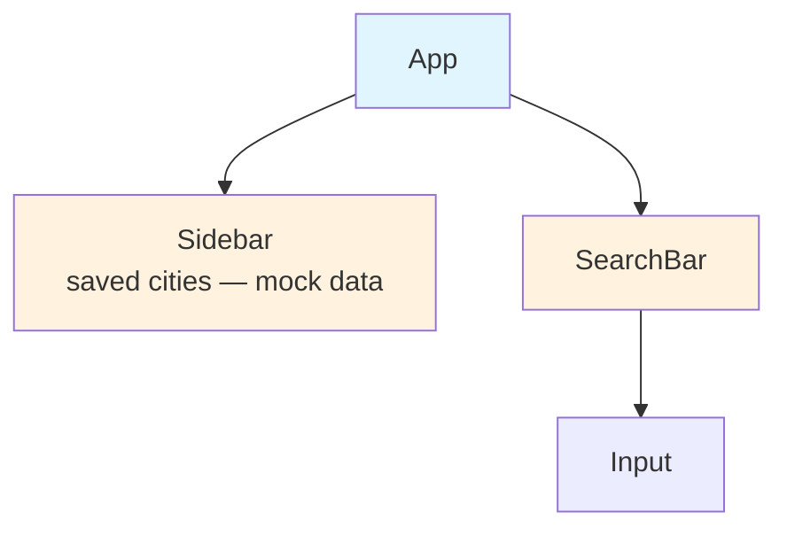
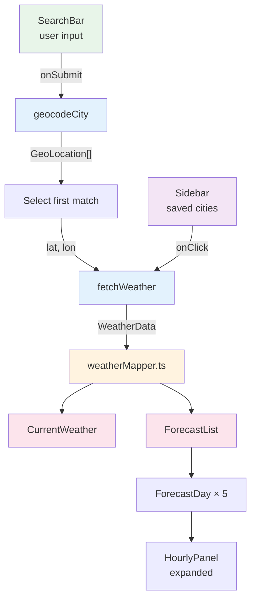
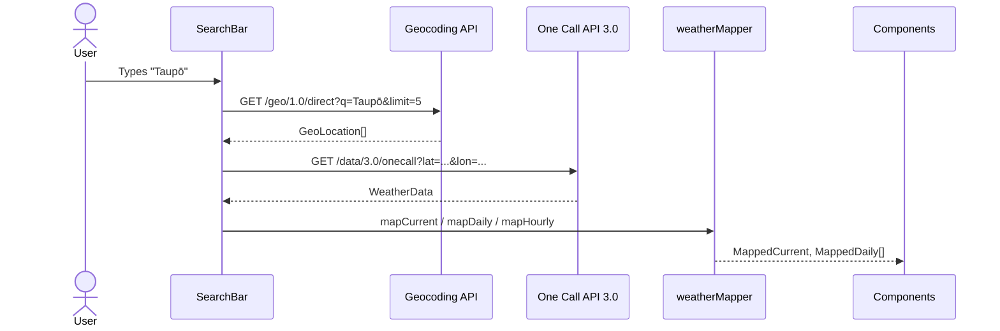

# 🌤️ Weather Dashboard — Senior Frontend Code Review

> [!NOTE]  
> Repository: [lowqualityloey/weather-dashboard](https://github.com/lowqualityloey/weather-dashboard)  
> Reviewer: Senior Frontend Engineer  
> Date: 2026-08-11

---

## 📋 Table of Contents

- [[Weather Dashboard - Review#Executive Summary|Executive Summary]]
- [[Weather Dashboard - Review#1. Architecture & Stack Assessment|1. Architecture & Stack]]
- [[Weather Dashboard - Review#2. Type Safety & Data Modeling|2. Type Safety]]
- [[Weather Dashboard - Review#3. API Integration & Data Flow|3. API Integration]]
- [[Weather Dashboard - Review#4. State Management & Persistence|4. State Management]]
- [[Weather Dashboard - Review#5. Component Design & UI Patterns|5. Component Design]]
- [[Weather Dashboard - Review#6. Styling & Design System|6. Styling]]
- [[Weather Dashboard - Review#7. Performance & Optimization|7. Performance]]
- [[Weather Dashboard - Review#8. Testing & Quality Assurance|8. Testing]]
- [[Weather Dashboard - Review#9. Deployment & DevOps|9. Deployment]]
- [[Weather Dashboard - Review#10. Improvements & Refactoring Roadmap|10. Roadmap]]
- [[Weather Dashboard - Review#Action Plan|Action Plan]]
- [[Weather Dashboard - Review#Visual Data Flow Diagram|Data Flow Diagram]]

---

## Executive Summary

> [!TIP] Bottom Line Up Front
> The project has a **strong foundation** but is **incomplete**. Modern stack, clean architecture, good TypeScript hygiene — but the core feature pipeline (Search → API → Display) is disconnected and most components are empty stubs.

| Aspect | Status | Notes |
|--------|--------|-------|
| **Stack** | ✅ Solid | React 19, TS 6, Tailwind v4, shadcn/ui — mid-2026 best practices |
| **Architecture** | 🟡 Incomplete | Clean separation, but missing state management & error handling |
| **Type Safety** | ✅ Strong | Comprehensive interfaces, but runtime gaps exist |
| **Production-Ready** | ❌ No | No API key, no loading/error states, disconnected pipeline |

---

## 1. Architecture & Stack Assessment

### Tech Stack Evaluation

| Technology | Version | Verdict |
|------------|---------|---------|
| React | 19.2.7 | ✅ Latest stable; no RSC used |
| TypeScript | 6.0.2 | ✅ Strict mode, `verbatimModuleSyntax` |
| Vite | 8.1.1 | ✅ Fast dev server, Rollup bundling |
| Tailwind CSS | 4.3.3 | ✅ CSS-first `@theme`, `oklch()` colors |
| shadcn/ui + Base UI | 1.6.0 | ✅ Composable; smaller community than Radix |
| Lucide React | 1.27.0 | ✅ Tree-shakeable |

**Strengths:**
- Tailwind v4's CSS-first theming with `oklch()` provides perceptually uniform, HDR-ready colors
- Base UI primitives are headless and accessible
- Vite path aliasing (`@/`) improves import ergonomics

**Trade-offs:**
- **React 19** is cutting-edge — some ecosystem libs may lag
- **Base UI** has smaller community vs. Radix — fewer resources
- **Tailwind v4** is very new — less Stack Overflow/blog coverage
- **No backend** — API key exposed client-side (see §3)

### Project Structure

```
src/
├── components/
│   ├── ui/              ✅ shadcn/ui primitives
│   ├── SearchBar.tsx    🟡 Partially implemented
│   ├── Sidebar.tsx      🟡 Mock data only
│   ├── CurrentWeather.tsx   ❌ Empty stub
│   ├── ForecastList.tsx     ❌ Empty stub
│   └── ForecastDay.tsx      ❌ Empty stub
├── lib/
│   ├── openWeather.ts   ✅ API layer
│   ├── weatherMapper.ts ✅ Transformation layer
│   ├── weatherIcons.ts  ✅ Icon helpers
│   └── utils.ts         ✅ cn() utility
├── types/
│   └── weather.ts       ✅ TypeScript interfaces
├── App.tsx              ✅ Shell layout
├── main.tsx             ✅ Entry point
└── index.css            ✅ Tailwind v4 + theme tokens
```

> [!INFO] Separation of Concerns
> The `lib/`, `types/`, `components/` split is **optimal**. External concerns are encapsulated, contracts are defined separately, and UI owns presentation.

**Recommended Reorganization:**

1. **Add `hooks/`** — `useWeather.ts`, `useLocalStorage.ts`, `useDebounce.ts`
2. **Add `contexts/` or `stores/`** — for global state (favourites, theme, weather data)
3. **Rename `Sidebar.tsx` → `CityList.tsx`** — it displays saved cities, not navigation

### Component Tree & Data Flow



> [!WARNING] Current State
> Components are **disconnected**. No data flows between them.

**Planned Data Flow (not yet implemented):**



---

## 2. Type Safety & Data Modeling

### `types/weather.ts` Analysis

**Core fields are well-mapped** to OpenWeather One Call API 3.0:
- `current.temp`, `current.feels_like`
- `current.humidity`, `current.wind_speed`, `current.wind_deg`
- `current.weather[0].description`, `current.weather[0].icon`
- `daily.slice(0, 5)` for forecast

**Missing fields for robustness:**

| Field | Type | Why It Matters |
|-------|------|----------------|
| `uvi` | `number` | Listed in README future improvements |
| `pop` | `number` | Probability of precipitation — key UX data |
| `pressure` | `number` | Meteorological value |
| `visibility` | `number` | Returned in current weather |
| `sunrise` / `sunset` | `number` | Present in current + daily |
| `snow` / `rain` | `{ 1h: number }` | Precipitation volume |
| `clouds` | `number` | Cloud coverage % |
| `weather[].id` | `number` | Condition code for programmatic logic |
| `weather[].main` | `string` | e.g. "Rain", "Clear" |
| Error responses | `GeoError` | API returns `{ cod: "404", message: "..." }` — untyped |

### `weatherMapper.ts` Robustness

**Good patterns:**
- Rounds temperatures and converts wind speed (m/s → km/h)
- Slices daily forecast to 5 days
- Timezone-aware date filtering for hourly data

**Vulnerabilities:**

```typescript
// ❌ No null safety — crashes if weather array is empty
description: current.weather[0].description,
icon: current.weather[0].icon,

// ❌ No validation that data.current exists
const { current } = data;
```

**Fix:**

```typescript
// ✅ Defensive mapping
description: current.weather[0]?.description ?? 'Unknown',
icon: current.weather[0]?.icon ?? '01d',
```

> [!WARNING] Runtime Safety Gap
> No Zod or runtime validation layer. Add schema validation for API responses to prevent runtime crashes on malformed data.

### `any` Types & Assertions

| Location | Issue | Severity |
|----------|-------|----------|
| `lib/openWeather.ts` | `res.json()` not narrowed — could be error object | 🟡 Medium |
| `.env` | Empty — runtime failure with `undefined` API key | 🔴 High |
| Component stubs | Return `null` | 🟢 Low (by design) |

---

## 3. API Integration & Data Flow

### API Flow Trace



### Error Handling Assessment

```typescript
// openWeather.ts — minimal
if (!res.ok) throw new Error('Geocoding request failed');
return res.json();
```

> [!CAUTION] Error Handling Gaps
> - No retry logic for transient failures
> - No distinction between 401 (bad key), 404 (not found), 429 (rate limit), 500 (server error)
> - Generic error messages hinder debugging
> - No loading state coordination

**Missing patterns:**
- ❌ Debouncing (search should wait ~300ms before API call)
- ❌ Caching (don't refetch same location within N minutes)
- ❌ AbortController (cancel stale requests on new input)

### API Key Security

```typescript
const API_KEY = import.meta.env.VITE_OPENWEATHER_API_KEY;
```

> [!DANGER] Security Implication
> `VITE_` prefixed variables are **injected into the client bundle at build time**. Anyone can extract the key from network requests or decompiled JS. OpenWeather has usage limits and billing — your key could be rate-limited or charged.

**Mitigation:**

| Approach | Effort | Best For |
|----------|--------|----------|
| API key restrictions (IP allowlist) | 5 min | Portfolio/demo apps ✅ |
| Serverless proxy (Cloudflare Workers) | 2 hrs | Production apps |
| Document risk in README | 2 min | Already done ✅ |

**Add runtime validation:**

```typescript
if (!API_KEY) {
  throw new Error(
    'Missing VITE_OPENWEATHER_API_KEY — app will not function. ' +
    'See README.md for setup instructions.'
  );
}
```

### Loading, Error, Empty States

> [!FAIL] Not Implemented
> Components are empty stubs. This is the **#1 gap** for production-readiness.

---

## 4. State Management & Persistence

### Current State

> [!INFO] No State Management
> Components are uncontrolled and static. No hooks, context, or external libraries manage shared state.

**Required architecture:**

| State | Scope | Persistence |
|-------|-------|-------------|
| Current weather | Global | None (refetch on load) |
| Saved cities (favourites) | Global | `localStorage` |
| Theme (light/dark) | Global | `localStorage` |
| Search loading | Local | None |
| Search error | Local | None |

### Favourites / LocalStorage

**Current:** `Sidebar.tsx` uses hardcoded mock data:

```typescript
const mockCities = [
  { name: 'Taupō', current: true },
  { name: 'Auckland', current: false },
  { name: 'Wellington', current: false },
];
```

**Recommended hook pattern:**

```typescript
function useLocalStorage<T>(key: string, initialValue: T) {
  const [stored, setStored] = useState<T>(() => {
    if (typeof window === 'undefined') return initialValue;
    const item = window.localStorage.getItem(key);
    return item ? JSON.parse(item) : initialValue;
  });

  useEffect(() => {
    window.localStorage.setItem(key, JSON.stringify(stored));
  }, [key, stored]);

  return [stored, setStored] as const;
}
```

> [!WARNING] Hydration Mismatch
> Rendering `localStorage` data during SSR/initial render causes hydration warnings. Load from `localStorage` inside `useEffect` (client-only) or use `useSyncExternalStore`.

**Schema migration strategy:**

```typescript
const STORAGE_VERSION = 1;

function migrate(data: unknown): SavedCity[] {
  if (!data || typeof data !== 'object') return [];
  const version = (data as { version?: number }).version ?? 0;
  if (version < 1) {
    // migrate from v0 (string[]) to v1 (object[])
    return (data as string[]).map(name => ({ name, lat: null, lon: null }));
  }
  return data as SavedCity[];
}
```

### Dark Mode

**Partially complete:** Tailwind v4 dark mode configured via `@custom-variant dark` and CSS variables.

**Missing:** No `ThemeToggle.tsx` component. Theme toggle is in README but not implemented.

**Implementation approach:**
- Use Tailwind's `dark:` variant (already set up)
- Add `ThemeProvider` context or `useTheme()` hook
- Persist to `localStorage` under `theme` key
- Toggle `class="dark"` or `class="light"` on `<html>`

---

## 5. Component Design & UI Patterns

### shadcn/ui Usage

| Component | Used In | Status |
|-----------|---------|--------|
| Input | SearchBar | ✅ Styled, `aria-invalid`, Base UI primitive |
| Label | SearchBar | ✅ Correctly associated via `htmlFor` |
| Card | Stubs only | ✅ Well-structured with slots |
| Collapsible | Stubs only | ✅ Correct for ForecastDay accordion |

**Assessment:** Components are used as primitives, not over-customized. `className` props allow Tailwind overrides.

**ForecastDay accordion pattern:**

```tsx
<Collapsible>
  <CollapsibleTrigger>Monday — 18° / 12°</CollapsibleTrigger>
  <CollapsibleContent>
    {/* hourly forecast grid */}
  </CollapsibleContent>
</Collapsible>
```

### Responsive Design

| Breakpoint | Sidebar | Main Content |
|------------|---------|--------------|
| Desktop (≥768px) | `w-80 shrink-0` visible | `flex-1 p-6` |
| Mobile (<768px) | `hidden` — **inaccessible** | Centered search |

> [!WARNING] Mobile Gap
> Saved cities are **completely inaccessible on mobile**. No hamburger menu, bottom sheet, or alternative navigation.

**Recommended fix:**

```tsx
<Sheet>
  <SheetTrigger asChild>
    <Button variant="ghost" size="icon">
      <Menu />
    </Button>
  </SheetTrigger>
  <SheetContent side="left">
    {/* City list */}
  </SheetContent>
</Sheet>
```

### Accessibility Review

| Check | Status | Notes |
|-------|--------|-------|
| SearchBar `role="search"` | ✅ | Proper landmark |
| Label `htmlFor` association | ✅ | Correct |
| Input `aria-invalid` | ✅ | Base UI primitive handles this |
| Sidebar links | ⚠️ | Uses `<a href="#">` — should be `<button>` |
| Loading announcements | ❌ | No `aria-live` region |
| Error announcements | ❌ | No `aria-live` region |
| Skip-to-content | ❌ | Missing |
| Weather icons | ❌ | OpenWeather PNGs have no `alt` text |
| Focus management | 🟡 | Base UI handles primitives; custom logic untested |

> [!TIP] Icon Accessibility
> Add `role="img"` with `aria-label` to weather icons, or map OpenWeather codes to Lucide icons for a fully accessible, self-contained solution.

---

## 6. Styling & Design System

### `index.css` Analysis

```css
@import 'tailwindcss';
@import url('https://fonts.googleapis.com/css2?family=Inter:wght@400;500;600;700&display=swap');

@custom-variant dark (&:where(.dark, .dark *));

@theme inline {
  --font-sans: 'Inter', ui-sans-serif, system-ui, sans-serif;
  --color-*: var(--*);
  /* ... */
}
```

**Strengths:**
- CSS-first configuration (no `tailwind.config.js`)
- Custom sidebar color tokens
- `oklch()` for perceptually uniform, HDR-ready colors
- Class-based dark mode variant

**Issues:**
- 🔴 Font loaded via Google Fonts URL — **blocks render**
- `@fontsource-variable/geist` is in `package.json` but never imported
- No `@layer components` for reusable abstractions

**Fix:**

```typescript
// main.tsx
import '@fontsource-variable/geist';
```

Then remove the Google Fonts `@import` from `index.css`.

### Weather Icons

```typescript
// weatherIcons.ts
export function getIconUrl(icon: string): string {
  return `https://openweathermap.org/img/wn/${icon}@2x.png`;
}
```

| Aspect | OpenWeather CDN | Lucide Mapping |
|--------|-----------------|----------------|
| Implementation | ✅ Easy | ⚠️ Requires mapping table |
| Accessibility | ❌ No `alt` support | ✅ Can add `aria-label` |
| Self-contained | ❌ External HTTP request | ✅ Bundled with app |
| Scalability | ❌ PNG, not scalable | ✅ SVG, scalable |
| Uptime dependency | ❌ Third-party CDN | ✅ None |

**Alternative mapping (example):**

| OpenWeather Code | Lucide Icon |
|------------------|-------------|
| `01d` | `Sun` |
| `01n` | `Moon` |
| `09d`, `09n` | `CloudRain` |
| `10d`, `10n` | `CloudDrizzle` |
| `13d`, `13n` | `Snowflake` |
| `50d`, `50n` | `CloudFog` |

### Design Language

> **From README:** "Pale blue gradient background, white rounded cards with soft shadows"

| Element | Implementation | Status |
|---------|---------------|--------|
| Background | `bg-background` → `oklch(0.94 0.02 245)` | ✅ Pale blue-ish white |
| Cards | `rounded-xl` + `ring-1 ring-foreground/10` | ✅ (when built) |
| Shadows | Tailwind defaults + ring | ✅ Soft, consistent |

---

## 7. Performance & Optimization

> [!INFO] Cannot Fully Assess
> No state management implemented yet. Below are patterns to adopt and pitfalls to avoid.

### Anti-Patterns to Avoid

| ❌ Don't | ✅ Do Instead |
|----------|---------------|
| Lift all state to `App` | Colocate weather data in `useWeather()` hook |
| Pass entire weather object to every component | Pass only needed slices |
| Re-run mappers on every render | Memoize with `useMemo` |
| Create new function references in render | Use `useCallback` for handlers |

### Bundle Size & Tree-Shaking

| Dependency | Tree-Shakeable? | Action |
|------------|-----------------|--------|
| `@base-ui/react` | ✅ Yes | — |
| `lucide-react` | ✅ Yes | Import only used icons |
| `tailwind-merge`, `clsx` | ✅ Yes | — |
| `react`, `react-dom` | ❌ No | Required |
| `tw-animate-css` | 🟡 Maybe | **Remove if unused** |

> [!TIP] Bundle Target
> Run `yarn build` and check `dist/assets/*.js`. A React weather app should be **<200KB gzipped**.

### Font Loading Fix

```css
/* ❌ Before — blocks render */
@import url('https://fonts.googleapis.com/css2?family=Inter...');

/* ✅ After — self-hosted, no blocking */
/* In main.tsx: import '@fontsource-variable/geist'; */
```

---

## 8. Testing & Quality Assurance

### Current State

> [!FAIL] No Tests
> Zero test files. No Vitest, no Testing Library, no Playwright.

### Recommended Test Stack

| Layer | Tool | Purpose |
|-------|------|---------|
| Unit | Vitest | Fast, Vite-native |
| Component | Testing Library | "What the user sees", not implementation |
| E2E | Playwright | Browser testing, React 19 compatible |

**Setup:**

```bash
yarn add -D vitest @vitejs/plugin-react   @testing-library/react @testing-library/jest-dom jsdom
```

```typescript
// vitest.config.ts
import { defineConfig } from 'vitest/config';
import react from '@vitejs/plugin-react';

export default defineConfig({
  plugins: [react()],
  test: {
    globals: true,
    environment: 'jsdom',
    setupFiles: ['./src/test/setup.ts'],
  },
});
```

**Priority test cases:**
1. `weatherMapper.ts` — unit test all mapping functions
2. `useWeather` hook — test loading, error, success states
3. `SearchBar` — test form submission
4. Integration — search → geocode → display flow (mock API)

### Linting & Formatting

| Tool | Config | Status |
|------|--------|--------|
| ESLint | Flat config, React Refresh, TS recommended | ✅ Good |
| Prettier | Print width 80, trailing commas, single quote | ✅ Standard |

> [!TIP] CI Enforcement
> Run `yarn lint` and `yarn format:check` in CI to block merges with style violations.

### TypeScript Configuration

```json
{
  "strict": true,
  "noUnusedLocals": true,
  "noUnusedParameters": true,
  "verbatimModuleSyntax": true,
  "moduleResolution": "bundler"
}
```

> [!SUCCESS] Excellent
> Strict mode, no dead code, modern module resolution. No changes needed.

---

## 9. Deployment & DevOps

### Cloudflare Pages Configuration

| Setting | Value | Status |
|---------|-------|--------|
| Framework | Vite | ✅ |
| Build command | `yarn build` | ✅ |
| Build output | `dist/` | ✅ |
| Environment variable | `VITE_OPENWEATHER_API_KEY` | ✅ Required |

### Recommended CI/CD Pipeline

```yaml
# .github/workflows/deploy.yml
name: Deploy

on:
  push:
    branches: [main]

jobs:
  deploy:
    runs-on: ubuntu-latest
    steps:
      - uses: actions/checkout@v4
      - uses: actions/setup-node@v4
        with:
          node-version: 20
          cache: 'yarn'
      - run: yarn install
      - run: yarn lint
      - run: yarn build
      - uses: cloudflare/pages-action@v1
        with:
          apiToken: ${{ secrets.CLOUDFLARE_API_TOKEN }}
          accountId: ${{ secrets.CLOUDFLARE_ACCOUNT_ID }}
          projectName: weather-dashboard
          directory: dist
```

> [!INFO] Env Var Note
> Add `VITE_OPENWEATHER_API_KEY` in the **Cloudflare Pages dashboard**, not GitHub Secrets — client-side builds need it at build time.

### Security Headers

```typescript
// vite.config.ts
export default defineConfig({
  plugins: [react(), tailwindcss()],
  server: {
    headers: {
      'Content-Security-Policy': 
        "default-src 'self'; " +
        "img-src https://openweathermap.org; " +
        "style-src 'self' https://fonts.googleapis.com; " +
        "font-src 'self' https://fonts.gstatic.com; " +
        "script-src 'self'",
    },
  },
});
```

### PWA Configuration

```bash
yarn add -D vite-plugin-pwa
```

```typescript
// vite.config.ts
import { VitePWA } from 'vite-plugin-pwa';

export default defineConfig({
  plugins: [
    react(),
    tailwindcss(),
    VitePWA({
      registerType: 'autoUpdate',
      manifest: {
        name: 'Weather Dashboard',
        short_name: 'Weather',
        start_url: '/',
      },
    }),
  ],
});
```

---

## 10. Improvements & Refactoring Roadmap

### Feature Priority

| Priority | Feature | Rationale |
|----------|---------|-----------|
| **P0** | Connect API to SearchBar + display weather | Core functionality — app does nothing without this |
| **P0** | Loading / error / empty states | UX baseline for any async app |
| **P1** | Save favourite cities to localStorage | High-value feature from README |
| **P1** | Dark mode toggle | Promised in spec; easy with Tailwind v4 |
| **P2** | Browser geolocation | UX differentiator |
| **P2** | Skeleton loading states | Polish |
| **P3** | Request caching + debouncing | Performance & API quota protection |

### Technical Debt Register

| Debt Item | Current | Fix | Effort |
|-----------|---------|-----|--------|
| Empty component stubs | Return `null` | Build out each component | 4–6 hrs |
| No state management | None | `WeatherContext` + `useWeather` | 2–3 hrs |
| No error handling | Generic `throw` | `ApiError` types, retry logic | 2 hrs |
| No debouncing | Every keystroke hits API | `useDebounce` hook | 1 hr |
| No loading states | No spinners | Add `loading` to `useWeather` | 1 hr |
| Render-blocking font | Google Fonts import | `@fontsource-variable/geist` | 30 min |
| Inaccessible icons | CDN PNGs, no `alt` | Map to Lucide icons | 2 hrs |
| Mobile sidebar missing | Hidden on mobile | Add `Sheet` component | 1 hr |
| No test suite | Zero tests | Vitest + Testing Library | 1 day |

### Scaling Architecture

| Scenario | Recommendation |
|----------|----------------|
| Multiple weather providers | Abstract `WeatherProvider` interface |
| Hide API keys | Cloudflare Worker / Vercel Edge Function proxy |
| Real-time updates | WebSocket or Server-Sent Events |
| Offline support | Service Worker + IndexedDB |
| Multi-language | i18next + translated descriptions |
| User accounts | Auth + cloud sync for favourites |

---

## Action Plan

### 🟢 Quick Wins (1–2 hours)

1. Add `VITE_OPENWEATHER_API_KEY` to `.env`
2. Import `@fontsource-variable/geist` in `main.tsx`; remove Google Fonts import
3. Remove `tw-animate-css` from `package.json` if unused
4. Add runtime API key validation with helpful error message
5. Run `yarn build` to verify production build
6. Add basic error boundary component

### 🟡 Medium Effort (1–2 days)

1. Create `hooks/useWeather.ts` — fetch + cache + loading + error
2. Create `contexts/WeatherContext.tsx` — global weather state
3. Implement SearchBar → geocodeCity → fetchWeather → display flow
4. Build `CurrentWeather` component
5. Build `ForecastList` + `ForecastDay` with `Collapsible`
6. Add `localStorage` persistence for favourite cities
7. Add dark mode toggle + theme persistence
8. Add debouncing to SearchBar input
9. Add mobile-friendly `Sheet` for city list

### 🔴 Strategic (1–2 weeks)

1. Add unit tests for `weatherMapper` functions
2. Set up Vitest + React Testing Library
3. Add E2E tests with Playwright
4. Implement skeleton loading states
5. Add browser geolocation feature
6. Implement API response caching (30-min TTL)
7. Set up GitHub Actions CI pipeline
8. Configure PWA with service worker
9. Add CSP security headers

---

## Visual Data Flow Diagram

```mermaid
flowchart TB
    subgraph App["App.tsx"]
        direction TB

        subgraph Left[""]
            Sidebar["Sidebar<br/>(City List)"]
        end

        subgraph Right[""]
            Search["SearchBar<br/>(User Input)"]
            Current["CurrentWeather"]
            Forecast["ForecastList"]
            Day["ForecastDay × 5"]
            Hourly["HourlyPanel"]
        end

        Sidebar -->|select city| WeatherCtx
        Search -->|onSubmit| WeatherCtx
    end

    subgraph WeatherCtx["WeatherContext"]
        direction TB
        State["currentWeather<br/>dailyForecast[]<br/>hourlyForecast<br/>loading: boolean<br/>error: string"]
    end

    WeatherCtx --> Current
    WeatherCtx --> Forecast
    Forecast --> Day
    Day --> Hourly

    subgraph Lib["lib/"]
        direction TB
        OW["openWeather.ts<br/>- geocodeCity()<br/>- fetchWeather()"]
        WM["weatherMapper.ts<br/>- mapCurrent()<br/>- mapDaily()<br/>- mapHourly()"]
        WI["weatherIcons.ts<br/>- getIconUrl()<br/>- getWindDir()"]
    end

    WeatherCtx -->|calls| OW
    OW -->|raw data| WM
    WM -->|mapped data| WeatherCtx

    subgraph API["OpenWeather API"]
        Geo["Geocoding API<br/>→ coordinates"]
        One["One Call API 3.0<br/>→ weather data"]
    end

    OW -->|HTTP| Geo
    OW -->|HTTP| One

    subgraph Types["types/"]
        WT["weather.ts<br/>GeoLocation<br/>CurrentWeather<br/>DailyWeather<br/>HourlyWeather<br/>WeatherData"]
    end

    WT -.->|contracts| OW
    WT -.->|contracts| WM
    WT -.->|contracts| WeatherCtx

    style App fill:#e3f2fd
    style WeatherCtx fill:#fff3e0
    style Lib fill:#e8f5e9
    style API fill:#fce4ec
    style Types fill:#f3e5f5
    style Left fill:#e3f2fd
    style Right fill:#e3f2fd
```

---

> [!SUCCESS] Final Verdict
> **Strong foundation, incomplete implementation.** The modern stack, clean architecture, and TypeScript discipline are all excellent. The project needs 1–2 days of focused work to connect the API pipeline, build out the component stubs, and add basic state management. From there, it's polish and features.
