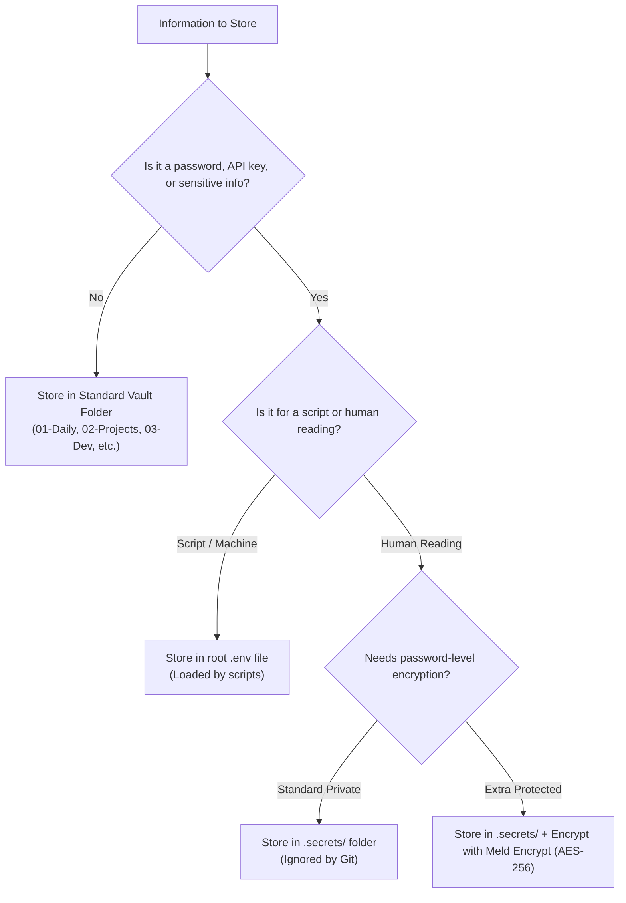

# 🛡️ Vault Security Policy

Canonical security specification for secret handling, private data storage, and Git leak prevention across this Obsidian vault.

---

## 1. Purpose

This policy defines the security standards for storing credentials, API keys, private notes, and sensitive personal information in this vault. Because this vault is backed up to a private remote repository via Git, strict separation between **tracked knowledge notes** and **un-tracked private secrets** is mandatory to prevent accidental credential exposure.

---

## 2. Storage Rules

| Storage Location | Target Data Type | Git Status | Description |
| :--- | :--- | :--- | :--- |
| **`.secrets/`** | Private human-readable notes (passwords, bank info, private logs) | 🚫 **Ignored** | Vault-local directory at root. Completely excluded from Git commits. |
| **`.env`** | Machine-readable credentials (API keys, tokens, DB connections) | 🚫 **Ignored** | Environment file loaded by integration scripts like [[06-Resources/scripts/ai-enrich-action.js\|ai-enrich-action.js]]. |
| **Normal Vault Folders** | Knowledge notes, projects, dev docs, learning | ✅ **Tracked** | Safe for public/private Git repo backup. MUST NOT contain secrets. |

---

## 3. Protection Levels

### Level 1: Git Exclusion (`.gitignore`)
* Configured in `.gitignore` at the vault root.
* Automatically ignores `.secrets/`, `00-Private/`, `*.env`, `*_secret*`, and `*_private*`.
* Ensures un-tracked secrets are never committed during `git add .` or background syncs.

### Level 2: Note Encryption (AES-256)
* Used for notes requiring password-level protection on screen or local disk.
* Implemented via plugins like **Meld Encrypt** (`obsidian-meld-encrypt`).
* Encrypts contents using AES-256-GCM so text remains unreadable without the master password.

### Level 3: Secret Rotation
* If any API key, password, or token is ever accidentally committed to Git:
  1. **Revoke and rotate** the key immediately at the provider (Google AI Studio, OpenAI, GitHub, etc.).
  2. Purge the Git commit history using `git filter-repo` or force push a clean tree.

---

## 4. Practical Rules

1. **No Hardcoded Secrets**: Never write real API keys, passwords, or PINs inside tracked Markdown notes, source code, or template files.
2. **Environment Variables**: For technical scripts (e.g. `ai-enrich-action.js`), always consume credentials via environment variables (`process.env.GEMINI_API_KEY`) loaded from `.env`.
3. **Template Safe Placeholders**: Keep an `.env.example` file containing placeholder keys (e.g. `GEMINI_API_KEY=your_key_here`) for documentation purposes.
4. **Password Manager Usage**: High-security credentials (master passwords, banking PINs) should primarily live in a dedicated password manager (Bitwarden / KeePass / 1Password).

---

## 5. Decision Guide



---

## 6. Example Layout

```text
loey_space/
├── .gitignore              # Configured to ignore .secrets/, *.env, etc.
├── .env                    # REAL API keys (Ignored by Git)
├── .env.example            # Placeholder documentation (Tracked by Git)
├── .secrets/               # Ignored private notes folder
│   ├── bank-notes.md       # Private note (Ignored by Git)
│   └── passwords.md        # Encrypted private note (Ignored by Git)
├── 03-Dev/                 # Code notes (Tracked, no secrets inside)
└── 06-Resources/
    └── Guides/
        └── Vault Security Policy.md  # This policy note
```

---

## 7. Review Checklist

- [ ] Check `git status` to verify `.secrets/` and `.env` are not listed under untracked files.
- [ ] Ensure `.env.example` contains only dummy placeholder values.
- [ ] Confirm no hardcoded API keys exist in `06-Resources/scripts/ai-enrich-action.js` or `99-Templates/`.
- [ ] Perform periodic secrets management audit before pushing major repository releases.

---

## 🔗 Related References

* [[Second Brain Guide]]
* [[Tagging & Properties]]
