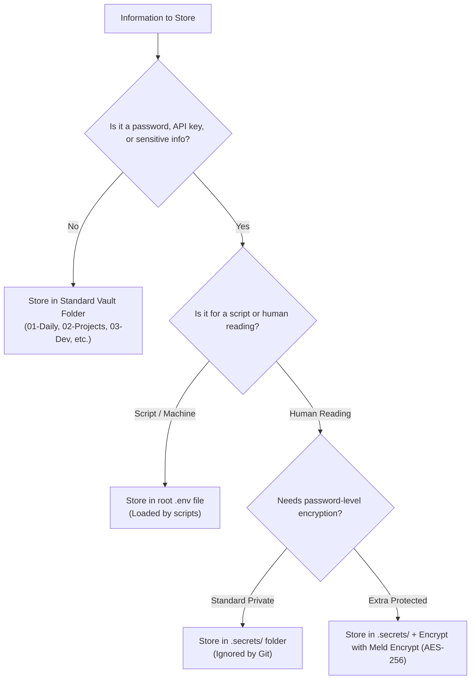

# 🛡️ Vault Security Policy

Canonical security specification for secret handling, private data storage, and Git leak prevention across this Obsidian vault.

---

## 1. Purpose

This policy defines the security standards for storing credentials, API keys, private notes, and sensitive personal information in this vault. The Git remote repository is **public**, so strict separation between **tracked system files** and **un-tracked private content** is mandatory to prevent accidental exposure. Owner boundary decisions (2026-10-03): keep the repo public and harden the boundary; assess published history privately before any remediation decision; no credential rotation (the local REST API config was verified never committed).

---

## 2. Storage Rules

| Storage Location | Target Data Type | Git Status | Description |
| :--- | :--- | :--- | :--- |
| **`.secrets/` & `00-Private/`** | Private human-readable sensitive notes (passwords, bank info, private logs) | 🚫 **Ignored** | Vault-local directory at root. Completely excluded from Git commits. |
| **`.env`** | Machine-readable credentials (API keys, tokens, DB connections) | 🚫 **Ignored** | Environment file loaded by integration scripts like [[06-Resources/scripts/ai-enrich-action.js\|ai-enrich-action.js]]. |
| **Personal Vault Content (`01-Daily/*`, `04-Learning/*`, `05-Personal/*`, etc.)** | Daily notes, study tracks, personal projects, journals, learning cohorts | 🚫 **Ignored** | Excluded structurally by `.gitignore`. Notes stay strictly local on your machine. |
| **System Blueprints, MOCs & Scripts** | MOC dashboards (`_*.md`), templates (`99-Templates/`), scripts, and guides | ✅ **Tracked** | Safe for the public Git repo. Defines the vault system without personal data. |
| **Plugin runtime config** (`.obsidian/plugins/*/data.json`, `*/cache.json`) | Local plugin state; may hold secrets | 🚫 **Ignored** | Excluded by explicit `.gitignore` rule (Wave 0, #29). Distributable code (`main.js`, `manifest.json`, `styles.css`) stays tracked. |

---

## 3. Protection Levels

### Level 1: Git Exclusion (`.gitignore`)
* Configured in `.gitignore` at the vault root.
* **Structural Boundary**: The system is shareable, the personal content is not. All numbered content folders (`00-Inbox/*`, `01-Daily/*`, `02-Projects/*`, `03-Dev/*`, `04-Learning/*`, `05-Personal/*`, `07-Reviews/*`, `08-Concepts/*`) ignore note files by default, tracking only structural `_*.md` MOC dashboards.
* Automatically ignores `.secrets/`, `00-Private/`, `*.env`, `*_secret*`, and `*_private*`.
* Ensures personal materials, study curricula, and un-tracked secrets are never staged during `git add .` or background syncs.

### Level 2: Note Encryption (AES-256)
* Used for notes requiring password-level protection on screen or local disk.
* Implemented via plugins like **Meld Encrypt** (`obsidian-meld-encrypt`).
* Encrypts contents using AES-256-GCM so text remains unreadable without the master password.

### Level 3: Secret Rotation
* If any API key, password, or token is ever accidentally committed to Git:
  1. **Revoke and rotate** the key immediately at the provider (Google AI Studio, OpenAI, GitHub, etc.).
  2. Purge the Git commit history using `git filter-repo` or force push a clean tree.

## 3a. Publication Boundary & Remediation Procedure (#31)

**Public set** (safe in the repo): system code and docs — `.obsidian/plugins/*/main.js|manifest.json|styles.css`, `06-Resources/scripts/`, `06-Resources/Guides/`, `99-Templates/`, structural `_*.md` MOCs, sanitized `data.example.json` defaults.

**Private set** (never in the repo): numbered content notes (`00-Inbox`, `01-Daily`, `02-Projects`, `03-Dev`, `04-Learning`, `05-Personal`, `07-Reviews`, `08-Concepts`, `99-Attachments` except listed showcases), `.secrets/`, `00-Private/`, `*.env` (except `.env.example`), `*_secret*`, `*_private*`, and all plugin runtime config (see Storage Rules).

**Remediation procedure** (owner-only, assess-first):
1. Inventory exposure privately: `git log --all` for the path, reachable published history, and current index state. Keep the inventory local — never in public issues, fixtures, or commits.
2. Decide per case: accept-and-harden-forward, rotate credentials (only on exposure evidence), rewrite history, or change visibility. Each is a separate recorded owner decision.
3. History rewrites, visibility changes, and rotations are never executed automatically by any script, hook, or agent task.

**Decision log**: 2026-10-03 — repo stays public with hardened boundary; published history goes through private assessment before any remediation decision; no REST API credential rotation (config verified never committed: empty `git log --all` for its `data.json`).

---

## 4. Practical Rules

1. **No Hardcoded Secrets**: Never write real API keys, passwords, or PINs inside tracked Markdown notes, source code, or template files.
2. **Environment Variables**: For technical scripts (e.g. `ai-enrich-action.js`), always consume credentials via environment variables (`process.env.GEMINI_API_KEY`) loaded from `.env`.
3. **Template Safe Placeholders**: Keep an `.env.example` file containing placeholder keys (e.g. `GEMINI_API_KEY=your_key_here`) for documentation purposes.
4. **Password Manager Usage**: High-security credentials (master passwords, banking PINs) should primarily live in a dedicated password manager (Bitwarden / KeePass / 1Password).

---

## 5. Decision Guide


```mermaid
flowchart TD
    A["Information to Store"] --> B{"Is it a password, API key, or sensitive info?"}
    B -- "No" --> C["Store in Standard Vault Folder\n(01-Daily, 02-Projects, 03-Dev, etc.)"]
    B -- "Yes" --> D{"Is it for a script or human reading?"}
    D -- "Script / Machine" --> E["Store in root .env file\n(Loaded by scripts)"]
    D -- "Human Reading" --> F{"Needs password-level encryption?"}
    F -- "Standard Private" --> G["Store in .secrets/ folder\n(Ignored by Git)"]
    F -- "Extra Protected" --> H["Store in .secrets/ + Encrypt with Meld Encrypt (AES-256)"]
```

---

## 6. Example Layout

```text
loey_space/
├── .gitignore              # Configured to ignore .secrets/, *.env, etc.
├── .env                    # REAL API keys (Ignored by Git)
├── .env.example            # Placeholder documentation (Tracked by Git)
├── .secrets/               # Ignored private notes folder
│   ├── bank-notes.md       # Private note (Ignored by Git)
│   └── passwords.md        # Encrypted private note (Ignored by Git)
├── 03-Dev/                 # Snippet notes (Ignored except structural MOCs; no secrets inside)
└── 06-Resources/
    └── Guides/
        └── Vault Security Policy.md  # This policy note
```

---

## 7. Review Checklist

- [ ] Check `git status` to verify `.secrets/` and `.env` are not listed under untracked files.
- [ ] Ensure `.env.example` contains only dummy placeholder values.
- [ ] Confirm no hardcoded API keys exist in `06-Resources/scripts/ai-enrich-action.js` or `99-Templates/`.
- [ ] Perform periodic secrets management audit before pushing major repository releases.

---

## 🔗 Related References

* [[Second Brain Guide]]
* [[Tagging & Properties]]
