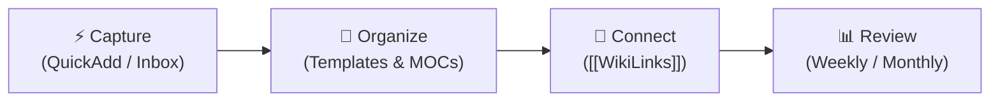

# 🧠 Second Brain Workflow Guide

> A simple, low-friction guide to using your Obsidian vault with QuickAdd, Folder Notes, and Dataview.

---

## 🔄 The Core Loop: Capture → Organize → Connect → Review

1. **Capture**: Dump ideas in 3 seconds using QuickAdd shortcuts.
2. **Organize**: QuickAdd applies templates automatically into Projects, Learning, or Resources.
3. **Connect**: Link reusable concepts (`[[React Hooks]]`, `[[weather-dashboard]]`) as you write.
4. **Review**: Automated Dataview widgets calculate habit stats, track progress, and flag stale projects.

---

## ⚡ 1. QuickAdd (Main Capture & Creation)
Use **QuickAdd** (`Ctrl + P` $\rightarrow$ `QuickAdd`) to eliminate friction:
- 📥 **Quick Capture to Inbox**: Dump quick thoughts/links without leaving your work.
- 🧠 **Append to Today's Daily Note**: Add thoughts directly into today's `## 🧠 Notes / Thoughts`.
- 🚀 **Create Project Note**: Generates structured project folder & note in `02-Projects/`.
- 📖 **Create Learning Note**: Generates course/tutorial note in `04-Learning/`.
- 📚 **Create Resource Note**: Generates documentation/tool note in `06-Resources/`.

---

## 📁 2. Folder Notes & MOC Hubs
- **One-Click Folders**: Clicking any main folder (`00-Inbox`, `03-Dev`, `04-Learning`, `05-Personal`, `06-Resources`, `07-Reviews`) instantly opens its Map of Content (MOC).
- **Automated Tables**: Dataview automatically tables and sorts your notes inside each folder MOC.

---

## ☕ 3. Daily Routine (5–10 Minutes)

### 🌅 Morning (2 min)
1. Open `Home.md` dashboard.
2. Open Today's Daily Note (in `01-Daily`).
3. Set `mood`, `energy`, `sleep_hours`, and pick your **Focus 3**.
   - *Note*: Unfinished tasks automatically carry forward under `## ↪ Carry Forward`.

### ☀️ Daytime (As you work/code/study)
- Use **QuickAdd** to capture thoughts or create Project/Learning/Resource notes.
- Check off habits (`exercise`, `meditate`, `coding`, `clean`, `hydrate`, `sleep`).

### 🌙 Evening (3 min)
- Fill in **Work / Study / Dev** progress.
- Write a 1-line **Daily Reflection** and set **Tomorrow Setup**.

---

## 📊 4. Reviews (`07-Reviews/`)

### 📅 Weekly Review (10–15 min, Sundays/Mondays)
- Trigger `99-Templates/Weekly Review.md`.
- View habit averages, completed tasks, and **Stale Projects** (flagged dynamically via `review_cycle`).
- Complete the 3 reflection questions.

### 🏆 Monthly Review (15 min, 1st of the Month)
- Trigger `99-Templates/Monthly Review.md`.
- Review completed projects, mastered study topics, and system friction.

---

## 🔗 5. Simple Rule: When to Link vs. Unlink

- 📥 **Leave Unlinked in Inbox**: Fast, temporary thoughts, quick clips, or unrefined ideas.
- 🔗 **Link (`[[Note Name]]`)**: Whenever a term represents a reusable entity you will reference again in coding, projects, or study (e.g. `[[React State]]`, `[[weather-dashboard]]`, `[[Tailwind]]`).

---

## 📋 6. "What Goes Where" Cheat Sheet

| Content / Idea                      | Action                      | Location                 | Template                                 |
| :---------------------------------- | :-------------------------- | :----------------------- | :--------------------------------------- |
| **Fast thought, quick link**        | QuickAdd: *Quick Capture*   | `00-Inbox/`              | Plain text                               |
| **Daily habits, focus, journaling** | Open Daily Note             | `01-Daily/YYYY-MM-DD.md` | `Daily.md`                               |
| **App build, multi-step goal**      | QuickAdd: *Create Project*  | `02-Projects/`           | `Project.md`                             |
| **Code snippet, syntax trick**      | QuickAdd / New Note         | `03-Dev/`                | `Snippet.md`                             |
| **Course, tutorial, study topic**   | QuickAdd: *Create Learning* | `04-Learning/`           | `Learning.md`                            |
| **Life notes, fitness, goals**      | New Note                    | `05-Personal/`           | Plain note                               |
| **Doc link, tool, cheatsheet**      | QuickAdd: *Create Resource* | `06-Resources/`          | `Resource.md`                            |
| **Weekly / Monthly Review**         | Create in `07-Reviews/`     | `07-Reviews/`            | `Weekly Review.md` / `Monthly Review.md` |
