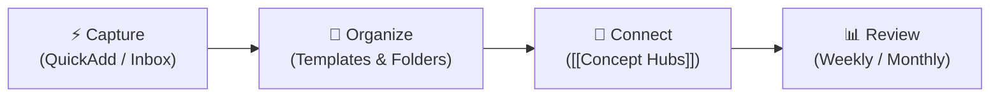

# 🧠 Second Brain Workflow Guide

> Comprehensive operational guide for your Obsidian vault — covering folder structure, QuickAdd creation flows, Concept hubs, API documentation, vault security, and daily routines.

---

## 🔄 The Core Loop: Capture → Organize → Connect → Review



1. **Capture**: Dump thoughts instantly with 1-click QuickAdd sidebar buttons.
2. **Organize**: QuickAdd auto-creates structured notes and folder trees.
3. **Connect**: Link concept words (`[[AI integration]]`, `[[Fetch API]]`) to generate evergreen concept notes with live Dataview backreferences.
4. **Review**: Automated Dataview MOCs calculate habit averages, track project status, and summarize weekly/monthly reviews.

---

## 🗂️ 1. Current Vault Folder Architecture

| Folder | Purpose | Key Contents & Notes |
| :--- | :--- | :--- |
| **`00-Inbox/`** | Fast triage & raw capture | `_Inbox MOC.md`, `quick-capture-dump.md` |
| **`01-Daily/`** | Daily logs & habit tracking | `YYYY-MM-DD.md`, `_Daily MOC.md` |
| **`02-Projects/`** | Active development builds | Subfolder per project (`Project Note` + `Kanban`), `_Projects MOC.md` |
| **`03-Dev/`** | Code snippets & tech patterns | `Dev.md` notes, debugging guides, `_Dev MOC.md` |
| **`04-Learning/`** | Courses, tutorials, & topics | Study topics, React notes, `_Learning MOC.md` |
| **`05-Personal/`** | Life notes, fitness, & goals | Reflections, gym logs, `_Personal MOC.md` |
| **`06-Resources/`** | Reference docs & API catalogs | `APIs/` subfolder, `notion-sync.js`, `Second Brain Guide.md`, `Vault Security Policy.md` |
| **`07-Reviews/`** | Periodic review archives | Weekly (`YYYY-[W]WW.md`) & Monthly (`YYYY-MM.md`) reviews, `_Reviews MOC.md` |
| **`08-Concepts/`** | Evergreen concepts & hubs | Concept notes (`YYYY-MM-DD_HHmm {{VALUE}}`), `_Concepts MOC.md` |
| **`99-Attachments/`** | Media storage | Monthly subfolders (`YYYY-MM/`), `_Attachments MOC.md` |
| **`99-Templates/`** | Note structure blueprints | `Daily.md`, `Project.md`, `Dev.md`, `Learning.md`, `Personal.md`, `Resource.md`, `Concept.md`, `API.md` |
| **`.secrets/`** | **Git-ignored** private notes | Bank details, private logs, credential notes |
| **`.env`** | **Git-ignored** script keys | `NOTION_API_KEY`, `VITE_OPENWEATHER_API_KEY` |

---

## ⚡ 2. QuickAdd Shortcuts & Sidebar Buttons

The vault features **10 1-click QuickAdd actions**. Each action creates the note, populates the template, and **opens immediately in a right split pane with focus**:

| Sidebar Icon | Choice Name | Type | Folder Target | Naming Format |
| :---: | :--- | :---: | :--- | :--- |
| 📥 | **Quick Capture to Inbox** | Capture | `00-Inbox/` | `quick-capture-dump.md` |
| 📅 | **Append to Today's Daily Note** | Capture | `01-Daily/` | `YYYY-MM-DD.md` |
| ⏰ | **Create Timestamped Daily Note** | Template | `01-Daily/` | `YYYY-MM-DD_HHmm {{VALUE}}` |
| 🚀 | **Create Project Note** | Template | `02-Projects/{{VALUE}}/` | `02-Projects/{{VALUE}}/{{VALUE}}.md` (+ Auto-Kanban) |
| 📖 | **Create Learning Note** | Template | `04-Learning/` | `YYYY-MM-DD_HHmm {{VALUE}}` |
| 📚 | **Create Resource Note** | Template | `06-Resources/` | `YYYY-MM-DD_HHmm {{VALUE}}` |
| 💻 | **Create Dev Note** | Template | `03-Dev/` | `YYYY-MM-DD_HHmm {{VALUE}}` |
| 🧘 | **Create Personal Note** | Template | `05-Personal/` | `YYYY-MM-DD_HHmm {{VALUE}}` |
| 💡 | **Create Concept Note** | Template | `08-Concepts/` | `YYYY-MM-DD_HHmm {{VALUE}}` |
| 🔌 | **New API Note** | Template | `06-Resources/APIs/` | `YYYY-MM-DD_HHmm {{VALUE}}` |

---

## 💡 3. Concept Notes & Auto-Routing

* **No Empty Notes**: When you write `[[AI integration]]` or `[[Fetch API]]` anywhere in your vault, Obsidian automatically creates the file inside **`08-Concepts/`**.
* **Templater Auto-Binding**: Bound `08-Concepts/` to `99-Templates/Concept.md`. On creation, the template auto-applies immediately.
* **Dataview Auto-Backlinks**: Every concept note includes a live Dataview block under `## Related notes (Auto-backlinks)`:
  ```dataview
  LIST
  FROM [[]] AND !"99-Templates"
  WHERE file.name != this.file.name
  SORT file.mtime DESC
  ```
  This automatically lists every note in your vault referencing that concept without manual typing.

---

## 🔒 4. Vault Security & API Documentation Policy

Refer to **[[06-Resources/Vault Security Policy|Vault Security Policy]]** for complete specs:

### Storage Boundaries
1. **`.env`**: Real API keys used by scripts (e.g. `notion-sync.js`). **Never committed to Git**.
2. **`.secrets/`**: Private human-readable sensitive notes. **Never committed to Git**.
3. **Tracked Vault Notes**: Documentation ONLY. **Zero actual API keys or secrets allowed**.

### API Documentation Rules (`06-Resources/APIs/`)
* Document API specs using `99-Templates/API.md`.
* Record variable names (`Environment variable name: VITE_OPENWEATHER_API_KEY`) and secret pointers (`Secret location: .env`).
* Keep a safe `.env.example` file at vault root containing placeholder keys only.

---

## ☕ 5. Daily Routine & Review Schedule

### Morning (2 min)
1. Open `Home.md` dashboard.
2. Open Today's Daily Note (`01-Daily/YYYY-MM-DD.md`).
3. Log `mood`, `energy`, `sleep_hours`, and set **Focus 3**.

### Evening (3 min)
1. Complete habit checkboxes (`coding`, `exercise`, `sleep`, etc.).
2. Fill out **Work / Study / Dev** progress and set **Tomorrow Setup**.

### Periodic Reviews (`07-Reviews/`)
* **Weekly Review** (`YYYY-[W]WW`): Habit averages, completed task rollup, and stale project audits.
* **Monthly Review** (`YYYY-MM`): 30-day wellness summary, completed projects, and strategic focus.

---

## 🔗 6. Orphan Notes & Link Management

### What is an Orphan Note?
An orphan note is a note with zero incoming links (`length(file.inlinks) = 0`).

### Guidance:
* **Inbox Notes**: Temporary orphan status is normal while drafting.
* **Permanent Notes**: When processing an inbox note, connect it to a Project, Learning topic, or Concept hub using `[[WikiLinks]]`.
* **Dashboard Monitor**: `Home.md` surfaces unlinked notes so you can periodically file or connect them.
