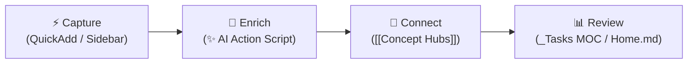

# 🧠 Second Brain Workflow Guide

> Comprehensive operational guide for your Obsidian vault — covering folder architecture, QuickAdd creation flows, Multi-Domain AI Enrichment, task management dashboards, concept hubs, and vault security policies.

---

## 🔄 The Core Loop: Capture → Enrich → Connect → Review

1. **Capture**: Log daily notes, dev snippets, learning items, or inbox entries with 1-click QuickAdd buttons.
2. **Enrich**: Trigger `Ctrl + Shift + A` or click `✨` to run the **Multi-Domain AI Enricher** ([`06-Resources/ai-enrich-action.js`](file:///C:/Users/jonel/OneDrive%20-%20雪玲团队/Documents/loey_space/06-Resources/ai-enrich-action.js)) for automatic summaries, reflections, code breakdowns, or domain lore.
3. **Connect**: Link concept words (`[[Fetch API]]`, `[[AI integration]]`) to populate evergreen concept notes with live Dataview backreferences.
4. **Review**: Check active tasks (`[/]`, `[ ]`) and completion histories on [`01-Daily/_Tasks MOC.md`](file:///C:/Users/jonel/OneDrive%20-%20雪玲团队/Documents/loey_space/01-Daily/_Tasks%20MOC.md) and [`Home.md`](file:///C:/Users/jonel/OneDrive%20-%20雪玲团队/Documents/loey_space/Home.md).

---

## 🗂️ 1. Current Vault Folder Architecture

| Folder | Purpose | Key Contents & Notes |
| :--- | :--- | :--- |
| **`Home.md`** | Central command dashboard | Quick navigation to all MOCs, active in-progress items, priority to-dos, active projects, and inbox status |
| **`00-Inbox/`** | Fast triage & raw capture | `_Inbox MOC.md`, `quick-capture-dump.md` |
| **`01-Daily/`** | Daily logs & habit tracking | `YYYY-MM-DD.md`, `_Daily MOC.md`, `_Tasks MOC.md` |
| **`02-Projects/`** | Active development builds | Subfolder per project (`Project Note` + `Kanban`), `_Projects MOC.md` |
| **`03-Dev/`** | Code snippets & tech patterns | Dev notes, debugging guides, `_Dev MOC.md` |
| **`04-Learning/`** | Courses, tutorials, & topics | Study topics, React notes, `_Learning MOC.md` |
| **`05-Personal/`** | Life notes, fitness, & goals | Reflections, gym logs, `_Personal MOC.md` |
| **`06-Resources/`** | Reference docs & scripts | `APIs/` subfolder, `ai-enrich-action.js`, `Second Brain Guide.md`, `Vault Security Policy.md` |
| **`07-Reviews/`** | Periodic review archives | Weekly (`YYYY-[W]WW.md`) & Monthly (`YYYY-MM.md`) reviews, `_Reviews MOC.md` |
| **`08-Concepts/`** | Evergreen concepts & hubs | Concept notes (`YYYY-MM-DD_HHmm {{VALUE}}`), `_Concepts MOC.md` |
| **`99-Attachments/`** | Media storage | Monthly subfolders (`YYYY-MM/`), `_Attachments MOC.md` |
| **`99-Templates/`** | Note structure blueprints | `Daily.md`, `Project.md`, `Dev.md`, `Learning.md`, `Personal.md`, `Resource.md`, `Concept.md`, `API.md` |
| **`.secrets/`** | **Git-ignored** private notes | Bank details, private logs, credential notes |
| **`.env`** | **Git-ignored** script keys | `GEMINI_API_KEY`, `OPENAI_API_KEY` |

---

## ⚡ 2. QuickAdd Shortcuts & AI Enrichment Action

The vault features 1-click QuickAdd actions and a universal **Multi-Domain AI Enricher macro**:

| Sidebar / Hotkey | Choice Name | Type | Folder Target | Naming / Function |
| :---: | :--- | :---: | :--- | :--- |
| **`✨` / `Ctrl+Shift+A`** | **AI Enrich Note** | Script Macro | Active Note | Multi-domain AI summary, reflection, code explanation, or concept lore |
| 📥 | **Quick Capture to Inbox** | Capture | `00-Inbox/` | `quick-capture-dump.md` |
| 📅 | **Append to Today's Daily Note** | Capture | `01-Daily/` | `YYYY-MM-DD.md` |
| ⏰ | **Create Timestamped Daily Note** | Template | `01-Daily/` | `YYYY-MM-DD_HHmm {{VALUE}}` |
| 🚀 | **Create Project Note** | Template | `02-Projects/{{VALUE}}/` | `02-Projects/{{VALUE}}/{{VALUE}}.md` |
| 💻 | **Create Dev Note** | Template | `03-Dev/` | `YYYY-MM-DD_HHmm {{VALUE}}` |
| 💡 | **Create Concept Note** | Template | `08-Concepts/` | `YYYY-MM-DD_HHmm {{VALUE}}` |
| 🔌 | **New API Note** | Template | `06-Resources/APIs/` | `YYYY-MM-DD_HHmm {{VALUE}}` |

---

## 🤖 3. Multi-Domain AI Enricher Engine (`ai-enrich-action.js`)

Pressing **`Ctrl + Shift + A`** or clicking **`✨`** automatically detects the active note category:

1. **📅 Daily Notes (`01-Daily/...`)**:
   - Parses mood, energy, sleep hours, completed vs open tasks, dev logs, leisure, and notes.
   - Generates a **1–2 paragraph concise narrative summary** (70–120 words) and **1-paragraph AI reflection** (50–90 words).
   - Generates a grounded quote callout (`> [!QUOTE] 💡 Daily Spark`) with author attribution.
   - Excludes template prompt noise and enforces a **strict ban on corporate buzzwords**.
   - Carries unfinished tasks directly into yesterday's `Tomorrow Setup`.
2. **💡 Concept Notes (`08-Concepts/...`)**:
   - **Tech / Programming**: Technical definitions, real-world utility, and runnable code snippets.
   - **Media / TV Shows** (e.g. *House of the Dragon*): Story premise, themes, and faction lore (**no fake code blocks!**).
   - **Wellness / Productivity**: Core principles and practical exercises.
3. **💻 Dev Notes (`03-Dev/...`)**:
   - Analyzes code snippets & titles to populate `language`, `tags`, `Context`, `Code Explanation`, and `Related` reference links.

---

## 📋 4. Task Management & Task History (`_Tasks MOC.md`)

- **Daily Notes as Source of Truth**: Tasks stay inside `01-Daily` and `02-Projects`. No duplicate task files required.
- **Task States**:
  - `- [ ] task` => **Active To-Do**
  - `- [/] task` => **In Progress** (Immediate focus anchor)
  - `- [x] task` => **Completed**
- **Habit Isolation**: Routine checkboxes under `## 🔁 Habits` are strictly excluded from task dashboards.
- **Source Link Attribution**: Every task displays its parent note link (e.g. `task text ([[2026-08-06_1010]])`).

---

## 🔒 5. Vault Security Policy

Refer to **[[06-Resources/Vault Security Policy|Vault Security Policy]]** for complete specs:

1. **`.env`**: Real API keys used by scripts (`GEMINI_API_KEY`). **Never committed to Git**.
2. **`.secrets/`**: Private human-readable sensitive notes. **Never committed to Git**.
3. **Tracked Vault Notes**: Documentation ONLY. **Zero actual API keys or secrets allowed**.

---

## ☕ 6. Daily Routine

### Morning (2 min)
1. Open [`Home.md`](file:///C:/Users/jonel/OneDrive%20-%20雪玲团队/Documents/loey_space/Home.md) central command hub.
2. Open Today's Daily Note (`01-Daily/YYYY-MM-DD.md`).
3. Log `mood`, `energy`, `sleep_hours`, and check carried tasks under `## ✅ Tasks`.

### Evening (3 min)
1. Complete habit checkboxes (`coding`, `exercise`, `sleep`, etc.).
2. Fill out **Work / Study / Dev** progress, notes, or small wins.
3. Press **`Ctrl + Shift + A`** or click **`✨`** to generate your AI summary, reflection, and quote!
