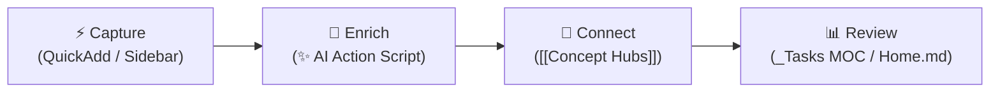

# 🧠 Second Brain Workflow Guide

> Comprehensive operational guide for your Obsidian vault — covering folder architecture, QuickAdd creation flows, Multi-Domain AI Enrichment, task management dashboards, concept hubs, and vault security policies.

---

## 🔄 The Core Loop: Capture → Enrich → Connect → Review

1. **Capture**: Log daily notes, dev snippets, learning items, or inbox entries with 1-click QuickAdd buttons.
2. **Enrich**: Trigger `Ctrl + Shift + A` or click `✨` to run the **Multi-Domain AI Enricher** ([`06-Resources/scripts/ai-enrich-action.js`](file:///C:/Users/jonel/OneDrive%20-%20雪玲团队/Documents/loey_space/06-Resources/scripts/ai-enrich-action.js)) for automatic summaries, reflections, code breakdowns, or domain lore.
3. **Connect**: Link concept words (`[[Fetch API]]`, `[[AI integration]]`) to populate evergreen concept notes with live Dataview backreferences.
4. **Review**: Check active tasks (`[/]`, `[ ]`) and completion histories on [`01-Daily/_Tasks MOC.md`](file:///C:/Users/jonel/OneDrive%20-%20雪玲团队/Documents/loey_space/01-Daily/_Tasks%20MOC.md) and [`Home.md`](file:///C:/Users/jonel/OneDrive%20-%20雪玲团队/Documents/loey_space/Home.md).

---

## 🗂️ 1. Current Vault Folder Architecture

| Folder | Purpose | What Goes Here |
| :--- | :--- | :--- |
| **🏠 `Home.md`** | Vault dashboard and entry point (a file, not a folder) | HomePulse dashboard, navigation to every MOC, active in-progress items, priority to-dos, active projects, inbox status |
| **📥 `00-Inbox/`** | Capture everything before sorting | Fleeting thoughts, quick captures, mobile captures, links to process later. Triage with `99-Templates/Triage.md`. Holds `_Inbox MOC.md` + `_Triage MOC.md`. **Rule: empty this weekly** |
| **📅 `01-Daily/`** | Time-stamped chronological notes — and the source of truth for tasks and habits | `YYYY-MM-DD.md` with `mood` / `energy` / `sleep_hours`, habit checkboxes, tasks, AI summary. Plus `_Daily MOC.md`, `_Tasks MOC.md`, `Habit Analytics Dashboard.md`. ✨ *AI-enrichable* |
| **🚀 `02-Projects/`** | Outcomes with deadlines or defined endpoints | One subfolder per project (project note + Kanban board), `_Projects MOC.md`. Active projects only — finished cards move to the board's own `## Archive` column, and the retrospective goes to `07-Reviews/` |
| **💻 `03-Dev/`** | Technical work and code-related knowledge | Dev logs, debugging notes, architecture decisions, snippets, `_Dev MOC.md`. ✨ *AI-enrichable* |
| **📖 `04-Learning/`** | Knowledge acquisition in progress | Courses, books, tutorials, study notes, `_Learning MOC.md`. Move finished learning into `08-Concepts/` (ideas) or `06-Resources/` (reference) |
| **👤 `05-Personal/`** | Private life administration | Health and fitness logs, finances, goals, personal journaling, `_Personal MOC.md`. Truly sensitive material belongs in `.secrets/`, not here |
| **📚 `06-Resources/`** | Reference material **and** working automation | Cheatsheets, manuals, how-tos, policies, `APIs/` specs, and `scripts/` (`ai-enrich-action.js`, weekly summary). Things you *refer to* or *run* — not things you're *working on* |
| **📊 `07-Reviews/`** | Periodic reflection — your looking-backward lens | Weekly (`YYYY-[W]WW.md`) and monthly (`YYYY-MM.md`) reviews, post-mortems, AI-generated summaries, `_Reviews MOC.md` |
| **💡 `08-Concepts/`** | Permanent notes — your distilled knowledge | Atomic ideas, principles, mental models (`YYYY-MM-DD_HHmm {{VALUE}}`), `_Concepts MOC.md`. Each note self-contained and linked. Carries `last_reviewed` + `review_cycle: 90d`. ✨ *AI-enrichable*. *The core of your Zettelkasten* |
| **📎 `99-Attachments/`** | Media and binary assets | Images, screenshots, PDFs, audio, exports — filed into monthly `YYYY-MM/` subfolders, plus `_Attachments MOC.md`. Keeps assets out of your note flow |
| **📋 `99-Templates/`** | Reusable note blueprints | `Daily.md`, `Concept.md`, `Dev.md`, `Project.md`, `Learning.md`, `Personal.md`, `Resource.md`, `API.md`, `Triage.md`, mobile capture templates. *Blueprints only — never edit these as notes* |
| **⚙️ `.obsidian/`** | Vault configuration and custom code | HomePulse plugin (`plugins/homepulse/`), CSS snippets, themes, hotkeys, plugin settings |
| **🪝 `.kiro/`** | Kiro IDE automation | Hooks for `.env` validation, Git safety, and inbox triage suggestions |
| **🔒 `.secrets/`** | **Git-ignored** private notes | Bank details, private logs, credential context. Never committed |
| **🔑 `.env`** | **Git-ignored** machine credentials | `GEMINI_API_KEY`, `OPENAI_API_KEY`. Read by the AI enricher — share `.env.example` instead |
| **📄 `README.md`** | Vault documentation | Setup guide, conventions, plugin list — for future you or a fresh clone |
| **⚖️ `LICENSE`** | Usage terms for the public repo | Leave as-is unless you change how others may reuse this vault |

> [!NOTE] 🗺️ Two conventions that hold this together
> - **MOC naming**: every folder has a `_*.md` MOC dashboard (13 in total). The leading underscore is what keeps MOCs out of Dataview results and AI link suggestions — don't rename them.
> - **AI enrichment scope**: `Ctrl + Shift + A` only works in `01-Daily`, `03-Dev`, and `08-Concepts`. Anywhere else it declines. If you want a note enriched, that's where it belongs.

---

## ⚡ 2. QuickAdd Shortcuts & AI Enrichment Action

The vault features 1-click QuickAdd actions and a universal **Multi-Domain AI Enricher macro**:

| Sidebar / Hotkey | Choice Name | Type | Folder Target | Naming / Function |
| :---: | :--- | :---: | :--- | :--- |
| **`✨` / `Ctrl+Shift+A`** | **AI Enrich Note** | Script Macro | Active Note | Multi-domain AI summary, reflection, code explanation, or concept lore |
| 📥 | **Quick Capture to Inbox** | Capture | `00-Inbox/` | `quick-capture-dump.md` |
| 📅 | **Append to Today's Daily Note** | Capture | `01-Daily/` | `YYYY-MM-DD.md` |
| ⏰ | **Create Timestamped Daily Note** | Template | `01-Daily/` | `YYYY-MM-DD_HHmm {{VALUE}}` |
| 🚀 | **Create Project Note** | Template | `02-Projects/{{VALUE}}/` | `02-Projects/{{VALUE}}/{{VALUE}}.md` |
| 💻 | **Create Dev Note** | Template | `03-Dev/` | `YYYY-MM-DD_HHmm {{VALUE}}` |
| 💡 | **Create Concept Note** | Template | `08-Concepts/` | `YYYY-MM-DD_HHmm {{VALUE}}` |
| 🔌 | **New API Note** | Template | `06-Resources/APIs/` | `YYYY-MM-DD_HHmm {{VALUE}}` |

---

## 🤖 3. Multi-Domain AI Enricher Engine (`ai-enrich-action.js`)

Pressing **`Ctrl + Shift + A`** or clicking **`✨`** automatically detects the active note category:

1. **📅 Daily Notes (`01-Daily/...`)**:
   - Parses mood, energy, sleep hours, completed vs open tasks, dev logs, leisure, and notes.
   - Generates a **1–2 paragraph concise narrative summary** (70–120 words) and **1-paragraph AI reflection** (50–90 words).
   - Generates a grounded quote callout (`> [!QUOTE] 💡 Daily Spark`) with author attribution.
   - Excludes template prompt noise and enforces a **strict ban on corporate buzzwords**.
   - Carries unfinished tasks directly into yesterday's `Tomorrow Setup`.
2. **💡 Concept Notes (`08-Concepts/...`)**:
   - **Tech / Programming**: Technical definitions, real-world utility, and runnable code snippets.
   - **Media / TV Shows** (e.g. *House of the Dragon*): Story premise, themes, and faction lore (**no fake code blocks!**).
   - **Wellness / Productivity**: Core principles and practical exercises.
3. **💻 Dev Notes (`03-Dev/...`)**:
   - Analyzes code snippets & titles to populate `language`, `tags`, `Context`, `Code Explanation`, and `Related` reference links.

---

## 📋 4. Task Management & Task History (`_Tasks MOC.md`)

- **Daily Notes as Source of Truth**: Tasks stay inside `01-Daily` and `02-Projects`. No duplicate task files required.
- **Task States**:
  - `- [ ] task` => **Active To-Do**
  - `- [/] task` => **In Progress** (Immediate focus anchor)
  - `- [x] task` => **Completed**
- **Habit Isolation**: Routine checkboxes under `## 🔁 Habits` are strictly excluded from task dashboards.
- **Source Link Attribution**: Every task displays its parent note link (e.g. `task text ([[2026-08-06_1010]])`).

### 🔁 Kanban Status Sync (automatic)

Card markers are maintained by the **Kanban Status Sync** plugin (`.obsidian/plugins/kanban-status-sync/`), so you never set a status by hand — **drag the card and the checkbox follows**. This is what lets `_Tasks MOC` tell an active to-do apart from work in progress.

| Lane | Marker applied |
| :--- | :--- |
| `Backlog`, `To Do`, `Next`, `Planned` | `- [ ]` |
| `In Progress`, `Doing`, `WIP` | `- [/]` |
| `Review / Test`, `QA`, `Testing` | `- [/]` |
| `Done`, `Complete`, `Shipped` | `- [x]` + `✅ YYYY-MM-DD` |
| `Archive` | left untouched |

Behaviour worth knowing:

1. **The board is the authority.** Editing a marker by hand without moving the card gets corrected on the next board save.
2. **Moving out of Done reverses cleanly** — both the `[x]` and the `✅` date are removed, so no card claims to be finished while sitting in To Do.
3. **Meaningful markers survive**: `[-]` cancelled, `[>]` forwarded, `[<]` scheduled, `[?]`, `[!]` are never overwritten by a lane rule.
4. **Only top-level cards are managed.** Indented subtasks inside a card, and any lane not listed above, are left alone.
5. **Lane names match loosely** — `## 🔄 In Progress`, `## Review/Test` and `## **Done**` all resolve correctly.

> [!WARNING] Don't enable Kanban's own lane completion setting
> Leave **"Mark items in this lane as complete"** switched off in the Kanban plugin's lane settings. Both features write the same checkbox and will fight over it.

Manual controls (`Ctrl + P`): **Sync card statuses in current board** and **Sync card statuses in all boards**. To change or add column names, edit the `LANE_MARKERS` object at the top of `main.js`.

---

## 🔒 5. Vault Security Policy

Refer to **[[06-Resources/Vault Security Policy|Vault Security Policy]]** for complete specs:

1. **`.env`**: Real API keys used by scripts (`GEMINI_API_KEY`). **Never committed to Git**.
2. **`.secrets/`**: Private human-readable sensitive notes. **Never committed to Git**.
3. **Tracked Vault Notes**: Documentation ONLY. **Zero actual API keys or secrets allowed**.

---

## ☕ 6. Daily Routine

### Morning (2 min)
1. Open [`Home.md`](file:///C:/Users/jonel/OneDrive%20-%20雪玲团队/Documents/loey_space/Home.md) central command hub.
2. Open Today's Daily Note (`01-Daily/YYYY-MM-DD.md`).
3. Log `mood`, `energy`, `sleep_hours`, and check carried tasks under `## ✅ Tasks`.

### Evening (3 min)
1. Complete habit checkboxes (`coding`, `exercise`, `sleep`, etc.).
2. Fill out **Work / Study / Dev** progress, notes, or small wins.
3. Press **`Ctrl + Shift + A`** or click **`✨`** to generate your AI summary, reflection, and quote!
