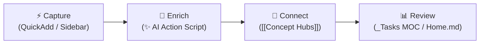

# 🧠 Second Brain Workflow Guide

> Comprehensive operational guide for your Obsidian vault — covering folder architecture, QuickAdd creation flows, Multi-Domain AI Enrichment, task management dashboards, concept hubs, and vault security policies.

---

## 🔄 The Core Loop: Capture → Enrich → Connect → Review



1. **Capture**: Log daily notes, dev snippets, learning items, or inbox entries with 1-click QuickAdd buttons.
2. **Enrich**: Trigger `Ctrl + Shift + A` or click `✨` to run the **Multi-Domain AI Enricher** ([`06-Resources/scripts/ai-enrich-action.js`](file:///C:/Users/jonel/OneDrive%20-%20雪玲团队/Documents/loey_space/06-Resources/scripts/ai-enrich-action.js)) for automatic summaries, reflections, code breakdowns, or domain lore.
3. **Connect**: Link concept words (`[[Fetch API]]`, `[[AI integration]]`) to populate evergreen concept notes with live Dataview backreferences.
4. **Review**: Check active tasks (`[/]`, `[ ]`) and completion histories on [`01-Daily/_Tasks MOC.md`](file:///C:/Users/jonel/OneDrive%20-%20雪玲团队/Documents/loey_space/01-Daily/_Tasks%20MOC.md) and [`Home.md`](file:///C:/Users/jonel/OneDrive%20-%20雪玲团队/Documents/loey_space/Home.md).

---

## 🗂️ 1. Current Vault Folder Architecture

| Folder | Purpose | What Goes Here |
| :--- | :--- | :--- |
| **🏠 `Home.md`** | Vault dashboard and entry point (a file, not a folder) | HomePulse dashboard, navigation to every MOC, active in-progress items, priority to-dos, active projects, inbox status |
| **📥 `00-Inbox/`** | Capture everything before sorting | Fleeting thoughts, quick captures, mobile captures, links to process later. Triage by tagging each line with a destination token, then running **Triage Sweep**. Holds `_Inbox MOC.md` + `_Triage MOC.md`. **Rule: empty this weekly** |
| **📅 `01-Daily/`** | Time-stamped chronological notes — and the source of truth for tasks and habits | `YYYY-MM-DD.md` with `mood` / `energy` / `sleep_hours`, habit checkboxes, tasks, AI summary. Plus `_Daily MOC.md`, `_Tasks MOC.md`, `Habit Analytics Dashboard.md`. ✨ *AI-enrichable* |
| **🚀 `02-Projects/`** | Outcomes with deadlines or defined endpoints | One subfolder per project (project note + Kanban board), `_Projects MOC.md`. Active projects only — finished cards move to the board's own `## Archive` column, and the retrospective goes to `07-Reviews/` |
| **💻 `03-Dev/`** | Technical work and code-related knowledge | Dev logs, debugging notes, architecture decisions, snippets, `_Dev MOC.md`. ✨ *AI-enrichable* |
| **📖 `04-Learning/`** | Knowledge acquisition in progress | Courses, books, tutorials, study notes, `_Learning MOC.md`. Move finished learning into `08-Concepts/` (ideas) or `06-Resources/` (reference) |
| **👤 `05-Personal/`** | Private life administration | Health and fitness logs, finances, goals, personal journaling, `_Personal MOC.md`. Truly sensitive material belongs in `.secrets/`, not here |
| **📚 `06-Resources/`** | Reference material **and** working automation | Cheatsheets, manuals, how-tos, policies, `APIs/` specs, and `scripts/` (`ai-enrich-action.js`, weekly summary). Things you *refer to* or *run* — not things you're *working on* |
| **📊 `07-Reviews/`** | Periodic reflection — your looking-backward lens | Weekly (`YYYY-[W]WW.md`) and monthly (`YYYY-MM.md`) reviews, post-mortems, AI-generated summaries, `_Reviews MOC.md` |
| **💡 `08-Concepts/`** | Permanent notes — your distilled knowledge | Atomic ideas, principles, mental models (`YYYY-MM-DD_HHmm {{VALUE}}`), `_Concepts MOC.md`. Each note self-contained and linked. Carries `last_reviewed` + `review_cycle: 90d`. ✨ *AI-enrichable*. *The core of your Zettelkasten* |
| **📎 `99-Attachments/`** | Media and binary assets | Images, screenshots, PDFs, audio, exports — filed into monthly `YYYY-MM/` subfolders, plus `_Attachments MOC.md`. Keeps assets out of your note flow |
| **📋 `99-Templates/`** | Reusable note blueprints | `Daily.md`, `Concept.md`, `Dev.md`, `Project.md`, `Learning.md`, `Personal.md`, `Resource.md`, `API.md`, mobile capture templates. *Blueprints only — never edit these as notes* |
| **⚙️ `.obsidian/`** | Vault configuration and custom code | HomePulse plugin (`plugins/homepulse/`), CSS snippets, themes, hotkeys, plugin settings |
| **🪝 `.kiro/`** | Kiro IDE automation | Hooks for `.env` validation, Git safety, and inbox triage suggestions |
| **🔒 `.secrets/`** | **Git-ignored** private notes | Bank details, private logs, credential context. Never committed |
| **🔑 `.env`** | **Git-ignored** machine credentials | `GEMINI_API_KEY`, `OPENAI_API_KEY`. Read by the AI enricher — share `.env.example` instead |
| **📄 `README.md`** | Vault documentation | Setup guide, conventions, plugin list — for future you or a fresh clone |
| **⚖️ `LICENSE`** | Usage terms for the public repo | Leave as-is unless you change how others may reuse this vault |

> [!NOTE] 🗺️ Two conventions that hold this together
> - **MOC naming**: every folder has a `_*.md` MOC dashboard (13 in total). The leading underscore is what keeps MOCs out of Dataview results and AI link suggestions — don't rename them.
> - **AI enrichment scope**: `Ctrl + Shift + A` only works in `01-Daily`, `03-Dev`, and `08-Concepts`. Anywhere else it declines. If you want a note enriched, that's where it belongs.

---

## ⚡ 2. QuickAdd Shortcuts & AI Enrichment Action

The vault features 1-click QuickAdd actions and a universal **Multi-Domain AI Enricher macro**:

| Sidebar / Hotkey | Choice Name | Type | Folder Target | Naming / Function |
| :---: | :--- | :---: | :--- | :--- |
| **`✨` / `Ctrl+Shift+A`** | **AI Enrich Note** | Script Macro | Active Note | Multi-domain AI summary, reflection, code explanation, or concept lore |
| **`🐙` / `Cmdr Ribbon`** | **Sync GitHub Project Kanban** | Script Macro | Active Kanban | Bi-directional sync with GitHub Projects v2 (`github_project_number`) |
| 📥 | **Quick Capture to Inbox** | Capture | `00-Inbox/` | `quick-capture-dump.md` (Timestamped `### 📅 YYYY-MM-DD HH:mm`) |
| 🧹 | **Triage Sweep** | Script Macro | `00-Inbox/` → destinations | `triage-sweep.js` (files every tagged capture line in one pass) |
| 🗃️ | **Archive & Clear Quick Capture Dump** | Script Macro | `00-Inbox/` | `clear-capture-dump.js` (Archives dump to `00-Inbox/Archives/`) |
| 📅 | **Append to Today's Daily Note** | Capture | `01-Daily/` | `YYYY-MM-DD.md` |
| ⏰ | **Create Timestamped Daily Note** | Template | `01-Daily/` | `YYYY-MM-DD_HHmm {{VALUE}}` |
| 🚀 | **Create Project Note** | Template | `02-Projects/{{VALUE}}/` | `02-Projects/{{VALUE}}/{{VALUE}}.md` |
| 💻 | **Create Dev Note** | Template | `03-Dev/` | `YYYY-MM-DD_HHmm {{VALUE}}` |
| 💡 | **Create Concept Note** | Template | `08-Concepts/` | `YYYY-MM-DD_HHmm {{VALUE}}` |
| 🔌 | **New API Note** | Template | `06-Resources/APIs/` | `YYYY-MM-DD_HHmm {{VALUE}}` |

---

### 🧹 Triage: tag the line, then sweep

Triage is a **decision**, not a document. Every capture resolves to one of eight verdicts, and the verdict is a token you append to the line in `quick-capture-dump.md`:

| Token | Destination | Frontmatter applied |
| :--- | :--- | :--- |
| `#do` | today's daily note, under `### ✅ Tasks` | — (becomes `- [ ]`) |
| `#dev` | `03-Dev/` | `type: snippet`, `area: dev` |
| `#concept` | `08-Concepts/` | `type: concept`, `review_cycle: 90d` |
| `#learn` | `04-Learning/` | `type: learning`, `review_cycle: 30d` |
| `#ref` | `06-Resources/` | `type: resource`, URL captured |
| `#personal` | `05-Personal/` | `type: personal` |
| `#project` | `02-Projects/<Name>/` | `type: project` + a Kanban board |
| `#bin` | dropped | — (logged, not filed) |

Then run **Triage Sweep** once. It files everything in a single pass:

```text
- i have to do laundry #do          ->  01-Daily/2026-08-13.md  (as a task)
- https://app.lofi.town/ #ref       ->  06-Resources/app.lofi.town.md
- semantic commit messages #concept ->  08-Concepts/semantic commit messages.md
- lemme test #bin                   ->  dropped
```

Behaviour worth knowing:

- **Untagged lines are never touched.** Tag only what you've decided on; the rest waits.
- **Nothing is silently deleted.** Swept lines move to a `## ✅ Triaged` log at the bottom of the dump, struck through, with the destination link and the token used. Set `ARCHIVE_SWEPT_LINES = false` at the top of `triage-sweep.js` to hard-delete instead.
- **Titles are derived, not demanded.** A bare link becomes a readable title (`boot.dev lessons`); a line with words keeps its own wording. Capture timestamps and tokens are stripped out.
- **`#do` respects the daily note's structure** — it inserts inside the Tasks section only, reusing the empty `- [ ]` placeholder if one exists, and never disturbs the project query block or Habits below it.
- **Name collisions get a numeric suffix** rather than overwriting an existing note.
- **Every created note records its origin**: `source: quick-capture` plus the original `captured:` date.

> [!TIP] Why the old triage form was removed
> `99-Templates/Triage.md` asked for ~40 checkboxes per item — more work than the thing being triaged, which is why the inbox accumulated items and zero triage notes were ever created. It also produced a *new* note in `00-Inbox` carrying `status: in-progress`, so triaging something made the inbox longer and added to the stale-notes queue. It has been deleted.
>
> If an item genuinely needs thinking through, it isn't inbox triage any more — it's a real note. Sweep it to its destination (`#concept`, `#dev`, `#project`) and think there: those templates already have Summary, Why it matters, Context and Next steps sections.

---

## 🤖 3. Multi-Domain AI Enricher Engine (`ai-enrich-action.js`)

> [!INFO] 📅 What the Daily enricher reads and writes
> **Reads**: `mood` / `energy` / `sleep_hours`, 🎯 Today's Focus, ✅ Tasks (completed, open, and `[>]` forwarded counted separately), 🔁 Habits (as *n* of 6), 📝 Daily Log, 💡 Ideas & Fleeting Notes, and the human-written Wins / Blockers / Reflection. Fenced blocks — including the project query — are ignored, never scraped as user data.
>
> **Writes** into 🤖 AI Daily Summary:
> - **Summary** — one casual "vibe" sentence naming the real things logged (the food, the fight, the crying), then up to 2 bullets on what moved forward, then 1 bullet on how you coped — only when coping is actually in the log.
> - **AI Reflection** — labelled `**Pattern:**` (the repeated behaviour across tasks, log and habits, including why some habits get ticked and others don't), `**Friction:**` (your Blockers, or the biggest untracked gap between timestamps), `**Insight:**` (one non-obvious connection).
> - **Suggested Next Step** — one small tactical move phrased *"Try [action] because [reason]"*. Never therapeutic.
> - **🔗 Connected Notes** — yesterday's note always first, then only notes actually named in your tasks, log or ideas. A logged URL can become a suggested title such as `[[Semantic Commit Messages]]`.
>
> **Voice contract**: conversational and sharp, like texting a smart friend — under 150 words, using your own wording. Clinical phrasing is banned ("emotional distress", "interpersonal conflict", "significant impact", "well-being"); the script warns in the console if any slips through. Every bad day gets its coping mechanism named rather than only its friction.
>
> **Link guard**: a suggested link survives only if it is yesterday's note, an existing note whose name you actually wrote, or a title whose words appear in what you wrote. That is what stops `[[API]]` or `[[Tasks Kanban]]` being invented out of an error message. If `sleep_hours` is under 6, the next step must acknowledge the sleep debt.

Pressing **`Ctrl + Shift + A`** or clicking **`✨`** automatically detects the active note category:

1. **📅 Daily Notes (`01-Daily/...`)**:
   - Parses mood, energy, sleep hours, completed vs open tasks, dev logs, leisure, and notes.
   - Generates a **1–2 paragraph concise narrative summary** (70–120 words) and **1-paragraph AI reflection** (50–90 words).
   - Generates a grounded quote callout (`> [!QUOTE] 💡 Daily Spark`) with author attribution.
   - Excludes template prompt noise and enforces a **strict ban on corporate buzzwords**.
   - Carries unfinished tasks directly into yesterday's `Tomorrow Setup`.
2. **💡 Concept Notes (`08-Concepts/...`)**:
   - **Tech / Programming**: Technical definitions, real-world utility, and runnable code snippets.
   - **Media / TV Shows** (e.g. *House of the Dragon*): Story premise, themes, and faction lore (**no fake code blocks!**).
   - **Wellness / Productivity**: Core principles and practical exercises.
3. **💻 Dev Notes (`03-Dev/...`)**:
   - Analyzes code snippets & titles to populate `language`, `tags`, `Context`, `Code Explanation`, and `Related` reference links.

---

## 📋 4. Task Management & Task History (`_Tasks MOC.md`)

- **Daily Notes as Source of Truth**: Tasks stay inside `01-Daily` and `02-Projects`. No duplicate task files required.
- **Task States**:
  - `- [ ] task` => **Active To-Do**
  - `- [/] task` => **In Progress** (Immediate focus anchor)
  - `- [x] task` => **Completed**
- **Habit Isolation**: Routine checkboxes under `## 🔁 Habits` are strictly excluded from task dashboards.
- **Source Link Attribution**: Every task displays its parent note link (e.g. `task text ([[2026-08-06_1010]])`).

### 🔁 Kanban Status Sync (automatic)

Card markers are maintained by the **Kanban Status Sync** plugin (`.obsidian/plugins/kanban-status-sync/`), so you never set a status by hand — **drag the card and the checkbox follows**. This is what lets `_Tasks MOC` tell an active to-do apart from work in progress.

| Lane | Marker applied |
| :--- | :--- |
| `Backlog`, `To Do`, `Next`, `Planned` | `- [ ]` |
| `In Progress`, `Doing`, `WIP` | `- [/]` |
| `Review / Test`, `QA`, `Testing` | `- [/]` |
| `Done`, `Complete`, `Shipped` | `- [x]` + `✅ YYYY-MM-DD` |
| `Archive` | left untouched |

Two rules decide what happens, in this order:

1. **Lane change wins.** Drag a card and its marker follows the new lane.
2. **Otherwise, a tick means done.** If a card stays in its lane but becomes `[x]`, that's a completion — the card **moves to the Done lane** and gets today's date.

Rule 2 is what lets you tick a project task from anywhere: the board, `_Tasks MOC`, or the project query in your daily note. The decision uses a stored snapshot of where each card sat on the previous sync, not the `✅` date, because the Tasks plugin may add that date itself when a checkbox is toggled.

Other behaviour worth knowing:

- **Moving out of Done reverses cleanly** — both the `[x]` and the `✅` date are removed, so no card claims to be finished while sitting in To Do.
- **Meaningful markers survive**: `[-]` cancelled, `[>]` forwarded, `[<]` scheduled, `[?]`, `[!]` are never overwritten.
- **Only top-level cards are managed.** Indented subtasks inside a card, and any lane not listed above, are left alone.
- **Lane names match loosely** — `## 🔄 In Progress`, `## Review/Test` and `## **Done**` all resolve correctly.
- **A card the plugin has not seen before** falls back to rule 1, so pasting in a pre-ticked card won't teleport it to Done.

### 🎯 Project tasks inside the daily note

`99-Templates/Daily.md` carries a live Dataview block under `## ✅ Tasks`:

`99-Templates/Daily.md` carries a `dataviewjs` block under `## ✅ Tasks` that lists:

1. project cards currently **in progress** (`[/]`), and
2. project cards **completed on that note's own date**, so a task you tick stays visible as done rather than vanishing.

It **queries** the boards rather than copying tasks, which is the whole point:

- **No duplication.** Each project task exists once on disk, so the Open Tasks widget, `_Tasks MOC` and the analytics counters each see it exactly once. The daily note contributes only the tasks you actually typed in it.
- **Nothing to carry over.** The carry-over only copies literal `- [ ]` lines, and a query block has none — so project work never accumulates as stale copies in tomorrow's note. The board keeps that state.
- **The checkbox is live.** Ticking it writes `[x]` to the Kanban card, rule 2 above moves that card to Done, and the task then appears under **Recently Completed** in `_Tasks MOC`.
- **Backlog and Archive are excluded**, matching the scope of every other task dashboard.

The block calls `dv.container.addClass("project-task-mirror")`, and the `project-tasks.css` snippet uses that hook to render `[/]` as an **empty checkbox inside daily notes only**. On the board and in `_Tasks MOC` the in-progress marker still looks like in-progress; in the daily note it reads as an ordinary open task you can tick. Nothing about the underlying status changes — only how it is drawn.

> [!NOTE] Existing daily notes need the block added by hand
> Template edits only affect newly created notes. The block was added to `01-Daily/2026-08-09.md` as well; copy it into any other note where you want the view.

### 🔄 Carry-over forwards, it does not copy

When a new daily note is created, unfinished `- [ ]` tasks move into it **and the previous note marks its copies as forwarded** (`- [>]`):

```text
2026-08-09    - [>] test task 1      ← history: this moved on
2026-08-10    - [ ] test task 1      ← the one live copy
```

This matters because every task dashboard reads *all* of `01-Daily`. Without forwarding, one carried task is open in two notes at once and gets counted twice — in `_Tasks MOC`, in the Open Tasks widget, and in the analytics totals. HomePulse's task indexer matches only `[ ]`, `[/]` and `[x]`, so `[>]` is invisible to it; `project-tasks.css` renders it as a faint `→`.

As a second layer, the **Currently In Progress**, **Active To-Dos** and **Task Completion Analytics** blocks in `_Tasks MOC` only count daily tasks from the *current* daily note (today, or the most recent day before today). Project tasks are never date-scoped — a board card stays open until the card itself moves. Completed totals remain all-time, since that is the history.

> [!TIP] Carry-over depends on the heading level
> The Templater carry-over matches `/^#{2,3}\s+.*(Tomorrow Setup|Tasks)/i`. It was previously `^##\s+`, which never matched the actual `### ✅ Tasks` heading, so nothing rolled forward. If you rename or re-level that heading, update this pattern too. The `####` project-query heading is deliberately below the matched levels so it does not close the section.

> [!WARNING] Dataview checkboxes break if the task text is rewritten
> `_Tasks MOC` pushes task objects unchanged and calls `dv.taskList(tasks, true)` to group them by file. Appending a file link to `t.text` — the previous approach — produces checkboxes that look clickable but silently fail to update the source note. Keep task text untouched in any query whose checkboxes you want to work. The **Recently Completed** list is exempt: it reformats dates for display only, so its boxes are read-only by design.

> [!WARNING] Don't enable Kanban's own lane completion setting
> Leave **"Mark items in this lane as complete"** switched off in the Kanban plugin's lane settings. Both features write the same checkbox and will fight over it.

Manual controls (`Ctrl + P`): **Sync card statuses in current board** and **Sync card statuses in all boards**. To change or add column names, edit the `LANE_MARKERS` object at the top of `main.js`.

---

## 🔒 5. Vault Security Policy

Refer to **[[06-Resources/Vault Security Policy|Vault Security Policy]]** for complete specs:

1. **`.env`**: Real API keys used by scripts (`GEMINI_API_KEY`). **Never committed to Git**.
2. **`.secrets/`**: Private human-readable sensitive notes. **Never committed to Git**.
3. **Tracked Vault Notes**: Documentation ONLY. **Zero actual API keys or secrets allowed**.

---

## ☕ 6. Daily Routine

### Morning (2 min)
1. Open [`Home.md`](file:///C:/Users/jonel/OneDrive%20-%20雪玲团队/Documents/loey_space/Home.md) central command hub.
2. Open Today's Daily Note (`01-Daily/YYYY-MM-DD.md`).
3. Log `mood`, `energy`, `sleep_hours`, and check carried tasks under `## ✅ Tasks`.

### Evening (3 min)
1. Complete habit checkboxes (`coding`, `exercise`, `sleep`, etc.).
2. Fill out **Work / Study / Dev** progress, notes, or small wins.
3. Press **`Ctrl + Shift + A`** or click **`✨`** to generate your AI summary, reflection, and quote!
