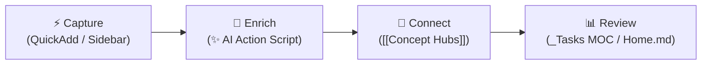
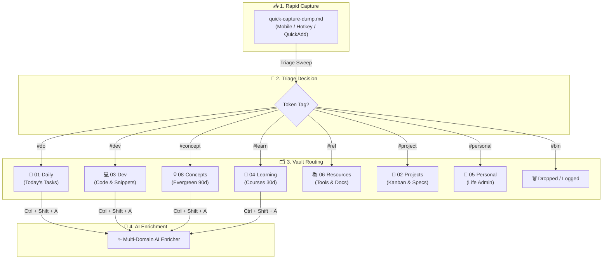
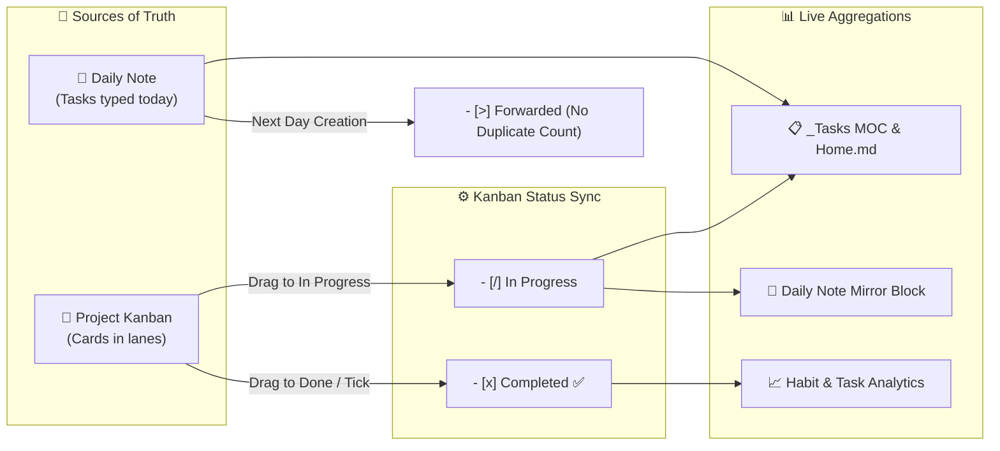

# 🧠 Second Brain Workflow Guide

> Comprehensive operational guide for your Obsidian vault — covering folder architecture, QuickAdd creation flows, Multi-Domain AI Enrichment, task management dashboards, concept hubs, maintenance rhythms, and vault security policies.

---

## 🔄 1. The Core Loop & Knowledge Routing

### The Core Loop: Capture → Enrich → Connect → Review



1. **Capture**: Log daily notes, dev snippets, learning items, or inbox entries with 1-click QuickAdd buttons.
2. **Enrich**: Trigger `Ctrl + Shift + A` or click `✨` to run the **Multi-Domain AI Enricher** ([`ai-enrich-action.js`](file:///c:/Users/jonel/Documents/loey_space/06-Resources/scripts/ai-enrich-action.js)) for automatic summaries, reflections, code breakdowns, or domain lore.
3. **Connect**: Link concept words (`[[Fetch API]]`, `[[AI integration]]`) to populate evergreen concept notes with live Dataview backreferences.
4. **Review**: Check active tasks (`[/]`, `[ ]`) and completion histories on [[01-Daily/_Tasks MOC|_Tasks MOC.md]] and [[Home|Home.md]].

---

### 🗺️ Knowledge Routing & Triage Flow



---

## 🗂️ 2. Vault Folder Architecture

| Folder | Purpose | What Goes Here |
| :--- | :--- | :--- |
| **🏠 `Home.md`** | Vault dashboard and entry point (file) | HomePulse dashboard, navigation to every MOC, active in-progress items, priority to-dos, active projects, inbox status |
| **📥 `00-Inbox/`** | Capture everything before sorting | Fleeting thoughts, quick captures, mobile captures, links to process later. Triage by tagging each line with a destination token, then running **Triage Sweep**. Holds `_Inbox MOC.md` + `_Triage MOC.md`. **Rule: empty this weekly** |
| **📅 `01-Daily/`** | Time-stamped chronological notes & tasks | `YYYY-MM/YYYY-MM-DD.md` with `mood` / `energy` / `sleep_hours`, habit checkboxes, tasks, AI summary. Plus `_Daily MOC.md`, `_Tasks MOC.md`, and visual `Tasks Kanban.md`. ✨ *AI-enrichable* |
| **🚀 `02-Projects/`** | Outcomes with deadlines or endpoints | One subfolder per project (project note + Kanban board), `_Projects MOC.md`. Active projects only — finished cards move to the board's own `## Archive` column, and retrospectives go to `07-Reviews/` |
| **💻 `03-Dev/`** | Technical work & code knowledge | Dev logs, debugging notes, architecture decisions, snippets, `_Dev MOC.md`. ✨ *AI-enrichable* |
| **📖 `04-Learning/`** | Knowledge acquisition in progress | Courses, books, tutorials, study notes, `_Learning MOC.md`. Move finished learning into `08-Concepts/` (ideas) or `06-Resources/` (reference). ✨ *AI-enrichable* |
| **👤 `05-Personal/`** | Private life administration | Health and fitness logs, finances, goals, personal journaling, `_Personal MOC.md`. Truly sensitive material belongs in `.secrets/`, not here |
| **📚 `06-Resources/`** | Reference material & automation | Cheatsheets, manuals, how-tos, policies, `APIs/`, `clipper-templates/` (Obsidian Web Clipper JSON presets), and `scripts/` (`ai-enrich-action.js`, `weekly-summary.js`). Things you *refer to* or *run* — not things you're *working on* |
| **📊 `07-Reviews/`** | Periodic reflection & retrospectives | Weekly (`YYYY-[W]WW.md`) and monthly (`YYYY-MM.md`) reviews, `Habit Analytics Dashboard.md`, post-mortems, AI-generated summaries, `_Reviews MOC.md` |
| **💡 `08-Concepts/`** | Permanent atomic knowledge | Atomic ideas, principles, mental models (`YYYY-MM-DD_HHmm {{VALUE}}`), `_Concepts MOC.md`. Each note self-contained and linked. Carries `last_reviewed` + `review_cycle: 90d`. ✨ *AI-enrichable*. *The core of your Zettelkasten* |
| **📎 `99-Attachments/`** | Media and binary assets | Images, screenshots, PDFs, audio, exports — filed into monthly `YYYY-MM/` subfolders, plus `_Attachments MOC.md`. Keeps assets out of your note flow |
| **📋 `99-Templates/`** | Reusable note blueprints | `Daily.md`, `Concept.md`, `Dev.md`, `Project.md`, `Learning.md`, `Personal.md`, `Resource.md`, `API.md`, mobile capture templates. *Blueprints only — never edit these as notes* |
| **⚙️ `.obsidian/`** | Vault configuration and custom code | HomePulse plugin (`plugins/homepulse/`), CSS snippets, themes, hotkeys, plugin settings |
| **🪝 `.kiro/`** | Kiro IDE automation | Hooks for `.env` validation, Git safety, and inbox triage suggestions |
| **🔒 `.secrets/`** | **Git-ignored** private notes | Bank details, private logs, credential context. Never committed |
| **🔑 `.env`** | **Git-ignored** machine credentials | `GEMINI_API_KEY`, `OPENAI_API_KEY`. Read by the AI enricher — share `.env.example` instead |
| **📄 `README.md`** | Vault documentation | Setup guide, conventions, plugin list — for future you or a fresh clone |
| **⚖️ `LICENSE`** | Usage terms for the public repo | MIT license — leave as-is |

> [!NOTE] 🗺️ Two conventions that hold this together
> - **MOC naming**: Every folder has a `_*.md` MOC dashboard (13 in total). The leading underscore keeps MOCs out of Dataview results and AI link suggestions — don't rename them.
> - **AI enrichment scope**: `Ctrl + Shift + A` works in `01-Daily`, `03-Dev`, `04-Learning`, and `08-Concepts`. Anywhere else it declines.

---

## ⚡ 3. QuickAdd Shortcuts & Triage System

### QuickAdd Action Catalog

| Sidebar / Hotkey | Choice Name | Type | Folder Target | Naming / Function |
| :---: | :--- | :---: | :--- | :--- |
| **`✨` / `Ctrl+Shift+A`** | **AI Enrich Note** | Script Macro | Active Note | Multi-domain AI summary, reflection, code explanation, or concept lore |
| **`🐙` / `Cmdr Ribbon`** | **Sync GitHub Project Kanban** | Script Macro | Active Kanban | Bi-directional sync with GitHub Projects v2 (`github_project_number`) |
| 📥 | **Quick Capture to Inbox** | Capture | `00-Inbox/` | `quick-capture-dump.md` (Timestamped `### 📅 YYYY-MM-DD HH:mm`) |
| 🧹 | **Triage Sweep** | Script Macro | `00-Inbox/` → destinations | `triage-sweep.js` (files every tagged capture line in one pass) |
| 🗃️ | **Archive & Clear Quick Capture Dump** | Script Macro | `00-Inbox/` | `clear-capture-dump.js` (Archives dump to `00-Inbox/Archives/`) |
| 📅 | **Append to Today's Daily Note** | Capture | `01-Daily/` | `YYYY-MM/YYYY-MM-DD.md` |
| ⏰ | **Create Timestamped Daily Note** | Template | `01-Daily/` | `YYYY-MM-DD_HHmm {{VALUE}}` |
| 🚀 | **Create Project Note** | Template | `02-Projects/{{VALUE}}/` | `02-Projects/{{VALUE}}/{{VALUE}}.md` |
| 💻 | **Create Dev Note** | Template | `03-Dev/` | `YYYY-MM-DD_HHmm {{VALUE}}` |
| 💡 | **Create Concept Note** | Template | `08-Concepts/` | `YYYY-MM-DD_HHmm {{VALUE}}` |
| 🔌 | **New API Note** | Template | `06-Resources/APIs/` | `YYYY-MM-DD_HHmm {{VALUE}}` |

---

### 🧹 Triage: Tag the Line, Then Sweep

Triage is a **decision**, not a document. Every capture resolves to one of eight verdicts by appending a token in `quick-capture-dump.md`:

| Token | Destination | Frontmatter applied |
| :--- | :--- | :--- |
| `#do` | today's daily note, under `### ✅ Tasks` | — (becomes `- [ ]`) |
| `#dev` | `03-Dev/` | `type: snippet`, `area: dev` |
| `#concept` | `08-Concepts/` | `type: concept`, `review_cycle: 90d` |
| `#learn` | `04-Learning/` | `type: learning`, `review_cycle: 30d` |
| `#ref` | `06-Resources/` | `type: resource`, URL captured |
| `#personal` | `05-Personal/` | `type: personal` |
| `#project` | `02-Projects/<Name>/` | `type: project` + a Kanban board |
| `#bin` | dropped | — (logged, not filed) |

Then run **Triage Sweep** (`🧹`). It processes everything in a single pass:

```text
- i have to do laundry #do          ->  01-Daily/2026-08-29.md  (as a task)
- https://app.lofi.town/ #ref       ->  06-Resources/app.lofi.town.md
- semantic commit messages #concept ->  08-Concepts/semantic commit messages.md
- lemme test #bin                   ->  dropped
```

> [!NOTE]- ⚙️ Triage Sweep Engine Mechanics (Click to expand)
> - **Untagged lines are never touched.** Tag only what you've decided on; the rest waits.
> - **Nothing is silently deleted.** Swept lines move to a `## ✅ Triaged` log at the bottom of the dump, struck through, with the destination link and the token used. Set `ARCHIVE_SWEPT_LINES = false` at the top of `triage-sweep.js` to hard-delete instead.
> - **Titles are derived, not demanded.** A bare link becomes a readable title (`boot.dev lessons`); a line with words keeps its own wording. Capture timestamps and tokens are stripped out.
> - **`#do` respects the daily note's structure** — it inserts inside the Tasks section only, reusing the empty `- [ ]` placeholder if one exists, and never disturbs the project query block or Habits below it.
> - **Name collisions get a numeric suffix** rather than overwriting an existing note.
> - **Every created note records its origin**: `source: quick-capture` plus the original `captured:` date.

---

### 🌐 Web Clipper Integration (`06-Resources/clipper-templates/`)

For browser capture, import the pre-built JSON templates into the **Obsidian Web Clipper** browser extension:
- **`inbox-quick-clip.json` / `inbox-quick-clip-ai.json`**: Capture web pages into `00-Inbox/` with optional AI bullets, ready for `#ref`/`#dev`/`#concept` tokens.
- **`resource-article.json` / `resource-article-ai.json`**: Save full articles with authors and synthesis into `06-Resources/Articles/`.
- **`dev-guide.json` / `dev-snippet.json`**: Save documentation and code blocks into `03-Dev/` or `06-Resources/`.
- **`github-repo.json` & `youtube-video.json`**: Capture repo metadata and video timestamps.

---

## 🤖 4. Multi-Domain AI Enricher Engine (`ai-enrich-action.js`)

Pressing **`Ctrl + Shift + A`** or clicking **`✨`** automatically detects the active note category and injects contextual insights:

| Domain | Notes Target | What AI Generates |
| :--- | :--- | :--- |
| **📅 Daily Notes** | `01-Daily/...` | Casual vibe summary, friction/pattern reflection, tactical next step, connected notes, and daily spark quote. Unfinished tasks carry into `Tomorrow Setup`. |
| **💡 Concept Notes** | `08-Concepts/...` | Technical definitions, real-world utility, runnable code snippets, or media/lore summaries (**no fake code blocks**). |
| **💻 Dev Notes** | `03-Dev/...` | Detects language, context, code explanations, and related architectural links. |
| **📖 Learning Notes** | `04-Learning/...` | Extracts evergreen concepts, reusable patterns, and active recall self-quiz flashcards. |

> [!INFO]- 🔍 Daily AI Enricher Contract & Voice Guard (Click to expand)
> **Reads**: `mood` / `energy` / `sleep_hours`, 🎯 Today's Focus, ✅ Tasks (completed, open, and `[>]` forwarded counted separately), 🔁 Habits (as *n* of 6), 📝 Daily Log, 💡 Ideas & Fleeting Notes, and human-written Wins / Blockers / Reflection. Fenced blocks — including the project query — are ignored.
>
> **Writes** into 🤖 AI Daily Summary:
> - **Summary** — one casual "vibe" sentence naming real events logged, up to 2 bullets on progress, 1 bullet on coping.
> - **AI Reflection** — labelled `**Pattern:**` (repeated behavior across tasks/habits), `**Friction:**` (blockers or timestamp gaps), `**Insight:**` (one non-obvious connection).
> - **Suggested Next Step** — small tactical move phrased *"Try [action] because [reason]"*. Never therapeutic.
> - **🔗 Connected Notes** — yesterday's note always first, then only notes actually named in tasks/logs.
>
> **Voice contract**: Conversational and sharp, like texting a smart friend — under 150 words. Clinical phrasing is banned ("emotional distress", "interpersonal conflict", "significant impact"). Link guard prevents hallucinated note titles. If `sleep_hours` is under 6, the next step acknowledges sleep debt.

---

## 📋 5. Task Management & Kanban Status Sync

### Task States & Architecture

- **Daily Notes as Source of Truth**: Tasks live directly inside `01-Daily` and `02-Projects`.
- **Interactive Visual Boards**: [[01-Daily/Tasks Kanban|Tasks Kanban.md]] provides an interactive drag-and-drop board for daily active focus, while [[01-Daily/_Tasks MOC|_Tasks MOC.md]] aggregates tasks across the entire vault with completion metrics.
- **Task Markers**:
  - `- [ ] task` $\rightarrow$ **Active To-Do**
  - `- [/] task` $\rightarrow$ **In Progress** (Immediate focus anchor)
  - `- [x] task` $\rightarrow$ **Completed** (`✅ YYYY-MM-DD`)
  - `- [>] task` $\rightarrow$ **Forwarded** (Carried to next day — excluded from open counts)
- **Habit Isolation**: Routine checkboxes under `## 🔁 Habits` are strictly excluded from task dashboards.

---

### 🔁 Task Lifecycle & Kanban Synchronization



Card markers are automatically maintained by the **Kanban Status Sync** plugin (`.obsidian/plugins/kanban-status-sync/`):

| Lane | Marker applied |
| :--- | :--- |
| `Backlog`, `To Do`, `Next`, `Planned` | `- [ ]` |
| `In Progress`, `Doing`, `WIP`, `Review / Test`, `QA` | `- [/]` |
| `Done`, `Complete`, `Shipped` | `- [x]` + `✅ YYYY-MM-DD` |
| `Archive` | *Untouched* |

> [!TIP] Two rules govern synchronization:
> 1. **Lane change wins**: Drag a card and its checkbox marker follows the lane.
> 2. **Ticking means done**: Ticking a card anywhere (board, `_Tasks MOC`, or Daily note mirror) moves it to the **Done** lane with today's date.

---

### 🎯 Project Tasks Mirror in Daily Notes

`99-Templates/Daily.md` carries a live `dataviewjs` block under `## ✅ Tasks` that queries project boards directly:
- Shows project cards currently **in progress** (`[/]`).
- Shows project cards **completed on today's date**.
- Rendered with `project-tasks.css` so in-progress cards look like checkable tasks in the daily view without duplicating data on disk.

> [!NOTE]- 🛠️ Task Engine Internals & Settings Guard (Click to expand)
> - **Carry-over forwards (`- [>]`)**: Unfinished `- [ ]` tasks move into tomorrow's note, marking yesterday's copy as `- [>]`. This prevents double-counting on dashboards.
> - **Heading regex**: Templater matches `/^#{2,3}\s+.*(Tomorrow Setup|Tasks)/i`.
> - **Dataview task immutability**: Checkbox clicking breaks if query scripts reformat `t.text`. Keep task text untouched in active query lists.
> - **Kanban settings**: Keep **"Mark items in this lane as complete"** *disabled* in Kanban lane settings so the custom sync plugin operates without conflict.

---

## 🛠️ 6. Vault Maintenance & Review Cadence

A healthy second brain requires periodic hygiene so notes remain actionable and clutter-free:

| Cadence | Focus Area | Key Actions |
| :--- | :--- | :--- |
| **☀️ Daily** *(5 min)* | `Home.md` & `01-Daily/` | - **Morning (2m)**: Check HomePulse, open today's note, log sleep/mood, review carried tasks.<br/>- **Evening (3m)**: Check off habits, log dev/work wins, press `Ctrl+Shift+A` (`✨`) for AI enrichment. |
| **🗓️ Weekly** *(15 min)* | `_Triage MOC` & `07-Reviews/` | - Open [[00-Inbox/_Triage MOC|_Triage MOC.md]] and process neglected items ($>7$ days).<br/>- Run `🧹 Triage Sweep` to clear `quick-capture-dump.md`.<br/>- Generate Weekly Review note (`YYYY-[W]WW.md`) with weekly AI rollup. |
| **🌙 Monthly** *(30 min)* | `07-Reviews/` & `02-Projects/` | - Review [[07-Reviews/Habit Analytics Dashboard|Habit Analytics Dashboard.md]] for habit consistency.<br/>- Check `_Triage MOC` for stale `in-progress` notes ($>30$ days untouched).<br/>- Move completed project cards to board `## Archive` and write project retrospectives. |
| **💡 Quarterly** *(45 min)* | `08-Concepts/` (`_Triage MOC`) | - Open `_Triage MOC` $\rightarrow$ **Overdue Reviews** table (`review_cycle: 90d`).<br/>- Revisit evergreen mental models, update with new insights, and refresh `last_reviewed: YYYY-MM-DD`. |

---

## 🔒 7. Vault Security Policy

Refer to [[06-Resources/Vault Security Policy|Vault Security Policy]] for complete operational guidelines:

1. **`.env`**: Stores real API keys used by scripts (`GEMINI_API_KEY`, `OPENAI_API_KEY`). **Git-ignored, never committed**.
2. **`.secrets/`**: Private human-readable credentials, financial, and personal logs. **Git-ignored, never committed**.
3. **Tracked Vault Notes**: Documentation ONLY. **Zero plaintext secrets or API tokens allowed**.

---

## 📚 Related Resources & Navigation

- 🏠 **[[Home|Central Command Hub (Home.md)]]**
- 🧹 **[[00-Inbox/_Triage MOC|Triage & Maintenance MOC]]**
- 🏷️ **[[06-Resources/Tagging & Properties|Tagging & Properties System]]**
- 📱 **[[06-Resources/Mobile Workflow Guide|Mobile Workflow Guide]]**
- 📊 **[[07-Reviews/Habit Analytics Dashboard|Habit Analytics Dashboard]]**
- 🔒 **[[06-Resources/Vault Security Policy|Vault Security Policy]]**

