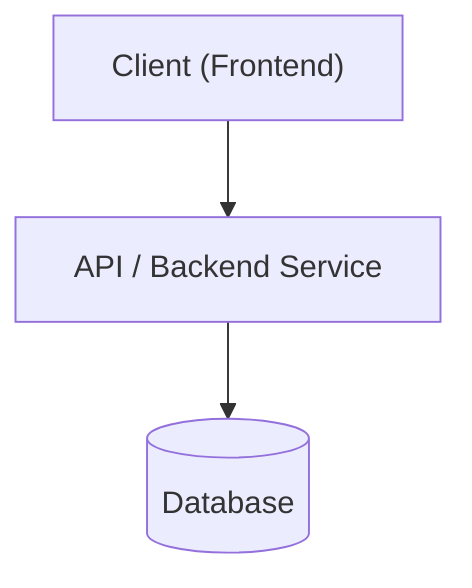

<%*
  const title = tp.file.title;
  const folder = tp.file.folder(true);
  if (title && title !== "Project") {
    const kanbanPath = `${folder}/${title} Kanban.md`;
    const kanbanContent = `---

kanban-plugin: board

---

## Backlog

## To Do

## In Progress

## Review / Test

## Done

%% kanban:settings
\`\`\`
{"kanban-plugin":"board"}
\`\`\`
%%`;

    if (!await tp.file.exists(kanbanPath)) {
      await app.vault.create(kanbanPath, kanbanContent);
    }
  }
-%>

# <% tp.file.title %>

## 🎯 Goal & Overview
- 

### 🏁 Definition of Done (MVP)
- [ ] Core user flows functional in production
- [ ] Responsive UI verified on mobile and desktop
- [ ] README documented with live demo URL and setup instructions

## 🗺️ System Architecture & Data Flow


## 🛠️ Tech Stack Matrix
| Layer | Tool / Tech | Responsibility |
| :--- | :--- | :--- |
| **Frontend** | | |
| **Backend / API** | | |
| **Database / State** | | |
| **Styling / UI** | | |
| **Deployment / CI** | | |

## 💡 Applied Architectural Concepts & Knowledge Links
- [[08-Concepts/ ]] — 
- [[04-Learning/ ]] — 

## 🔗 Key Links & Resources
- **Repository**: 
- **Live Demo**: 
- **GitHub Project Board**: 
- **Design / Figma**: 
- **Documentation**: 

## 📂 Project Structure
```text
src/
├── components/
├── lib/
└── types/
```

## ✨ Core Features & Scope
- 

## 🗄️ Data Model & API Contracts
- 

## 🚧 Risks, Constraints & Blockers
- None identified yet.

## 🚀 Setup & Development
- **Install**: `npm install`
- **Development**: `npm run dev`
- **Build**: `npm run build`
- **Test**: `npm test`

## 📋 Project Board
- [[<% tp.file.title %> Kanban|Open Visual Kanban Board]]

## 📜 Progress Log
- <% tp.date.now("YYYY-MM-DD") %>: Project created in planning status.
