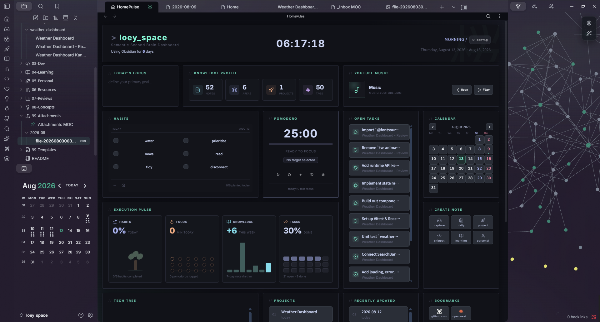
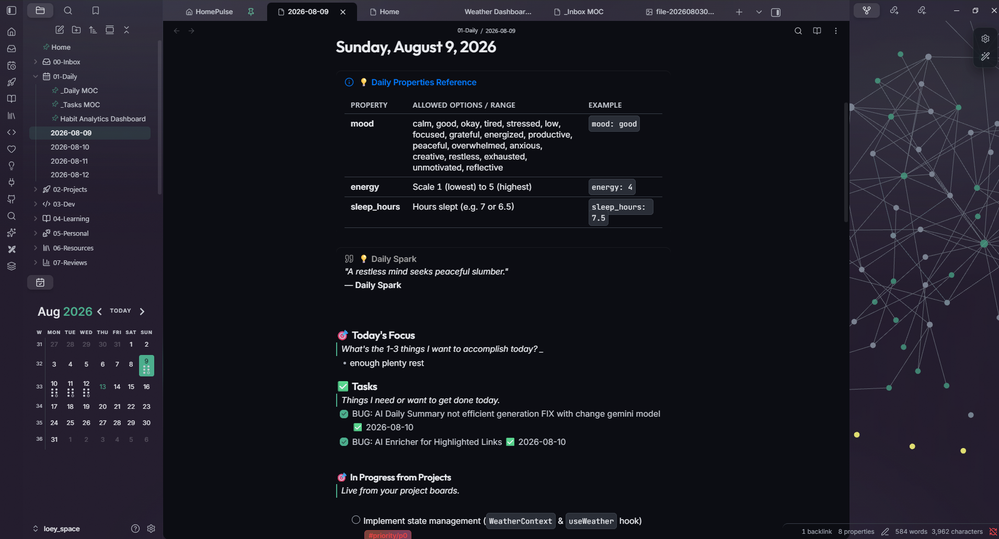
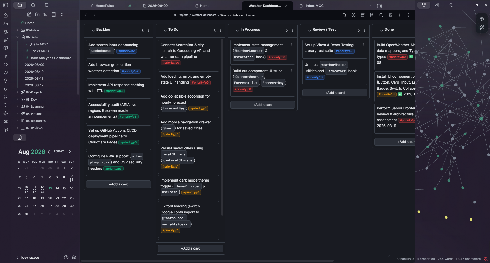

# 🧠 `loey_space` — Personal Knowledge Management & Second Brain Architecture

[](https://obsidian.md)
[](https://ai.google.dev)
[](LICENSE)
[](#-homepulse-command-center)

> A modular, automated, and secure **Personal Knowledge Management (PKM)** system built inside **Obsidian**. Engineered around the PARA/MOC methodology, real-time 2-way habit tracking, automated multi-domain AI enrichment, and a unified `#0C0D13` ultra-dark command center interface.

---

## 📚 Table of Contents

- [⚡ Quickstart](#-quickstart)
- [🖼️ Screenshots](#️-screenshots)
- [✨ Main Features](#-main-features)
- [🤖 AI Assistant & "Hey Loey" Dispatcher](#-ai-assistant--hey-loey-dispatcher)
- [⚡ HomePulse Command Center](#-homepulse-command-center)
- [🗂️ Vault Directory Architecture](#️-vault-directory-architecture)
- [📖 Documentation](#-documentation)
- [🛠️ Installation \& Setup Guide](#️-installation--setup-guide)
- [💡 Daily Workflows \& Keyboard Shortcuts](#-daily-workflows--keyboard-shortcuts)
- [📱 Mobile Workflow](#-mobile-workflow)
- [📊 Habit Analytics](#-habit-analytics)
- [📋 Task System Rules \& Conventions](#-task-system-rules--conventions)
- [🎨 Styling \& Aesthetics](#-styling--aesthetics)
- [🔒 Security \& Git Safety](#-security--git-safety)
- [🧯 Troubleshooting](#-troubleshooting)
- [🤝 Contributing](#-contributing)
- [🙏 Credits \& Acknowledgements](#-credits--acknowledgements)
- [📄 License](#-license)

---

## ⚡ Quickstart

Five minutes from clone to a working dashboard:

1. **Clone and open** — `git clone https://github.com/lowqualityloey/loey_space.git`, then in Obsidian choose **Open folder as vault**.
2. **Leave Restricted Mode** — Settings → Community plugins → **Turn on community plugins**. Nothing loads until you do.
3. **Turn auto-updates off** — Settings → Community plugins → **Auto-update plugins: OFF**. Two plugins here are local custom builds and an update replaces them.
4. **Add an API key** *(optional)* — `cp .env.example .env`, then paste a key from [Google AI Studio](https://aistudio.google.com/app/apikey) into `GEMINI_API_KEY`. Everything except AI enrichment works without one.
5. **Start today** — `Ctrl + P` → **HomePulse: Open Dashboard View**, then `Ctrl + P` → **QuickAdd: Create Daily Note**.

That's it. Habit tracking, task dashboards and the MOC queries all come alive as soon as a daily note exists.

> [!IMPORTANT]
> **Two things that will bite a fresh clone:**
>
> 1. **`homepulse` and `kanban-status-sync` are bundled custom builds** in `.obsidian/plugins/`. Do not install or update them from the Community Store — HomePulse would be replaced by stock code, and Kanban Status Sync isn't published there at all. Keep **Auto-update plugins: OFF**.
> 2. **Secrets live only in `.env`**, which is git-ignored. Copy `.env.example`, never commit real keys, and read the [Vault Security Policy](06-Resources/Vault%20Security%20Policy.md).

---

## 🖼️ Screenshots

### ⚡ HomePulse Command Center



The custom [HomePulse](#-homepulse-command-center) plugin: habits sync two ways with today's daily note, open tasks aggregate from daily notes and project kanbans, and Execution Pulse tracks focus minutes, note rhythm and completion ratios live.

### 📅 Daily Note



One note per day carrying `mood` / `energy` / `sleep_hours`, habits, a timestamped log, and an [AI Daily Summary](#multi-domain-ai-enricher-ctrl--shift--a) generated from what was actually logged. Unfinished tasks roll forward automatically; the previous day marks its copies `[>]` so nothing is counted twice.

### 🚀 Project Kanban



Each project gets a board. Card checkboxes follow their lane automatically — `To Do` is `[ ]`, `In Progress` is `[/]`, `Done` is `[x]` with a completion date — and ticking a card anywhere moves it to Done. Backlog and Archive stay out of the task dashboards.

---

## ✨ Main Features

| Feature | Description |
| :--- | :--- |
| **Loey Space AI Assistant** | Conversational Second Brain Chief of Staff & Digital Librarian triggered via `"hey loey"` (`AGENTS.md`) |
| **HomePulse Dashboard** | Custom native plugin with real-time widgets — habits, tasks, pomodoro, focus, projects, tech tree, activity heatmap, all in one view |
| **2-Way Habit Sync** | Toggle habits in the dashboard and they instantly update in today's daily note (and vice versa) |
| **Multi-Domain AI Enrichment** | One shortcut (`Ctrl+Shift+A`) analyzes any note — generates summaries for daily notes, explanations for concepts, code breakdowns for dev notes, study quizzes & concept extraction for learning notes |
| **Automatic Concept Distiller** | Extracts atomic evergreen mental models and principles from articles or dev notes into `08-Concepts/` with 90-day review cycles (`QuickAdd` / `npm run distill`) |
| **Kanban Issue & Branch Generator** | Converts Kanban cards into real GitHub Issues, switches git branch, and moves cards to In Progress (`QuickAdd` / `npm run start-task`) |
| **Vault Link & Graph Auditor** | Vault-wide scanner for broken wikilinks, fuzzy match fix suggestions, and orphan note discovery (`npm run audit-links`) |
| **Weekly AI Summaries** | Automated 7-day analysis of mood, energy, tasks, and habits with actionable recommendations |
| **Habit Analytics Dashboard** | 30-day rolling metrics, streak tracking, day-of-week patterns, and improvement recommendations |
| **Smart Task Management** | Tasks live in daily notes and project kanbans, aggregated in real-time via `_Tasks MOC.md` with status indicators (`[ ]`, `[/]`, `[x]`) |
| **Project Kanban Integration** | Each project gets a visual kanban board; tasks from To Do/In Progress/Review flow into the central task hub (Backlog excluded) |
| **Multi-Project GitHub Sync** | 2-way sync between Obsidian Kanbans and GitHub Projects v2 (`github_project_number`) via QuickAdd picker & CLI (`npm run sync-kanban`) |
| **Kanban Status Sync** | Drag a card between lanes and its checkbox follows automatically — To Do `[ ]`, In Progress `[/]`, Done `[x]` with a completion date |
| **Mobile Quick Capture** | 4 mobile-optimized commands for instant capture on the go — process later on desktop |
| **Inbox Auto-Classification** | Quick captures tagged with type/area/priority suggestions based on content analysis |
| **Token Triage Sweep** | Tag a capture line `#do` / `#dev` / `#concept` / `#learn` / `#ref` / `#personal` / `#project` / `#bin`, then file the whole inbox in one pass — swept lines are logged, never silently deleted |
| **Dynamic Tech Tree** | Auto-generated capability map scanning projects, concepts, and resources across the vault |
| **Execution Pulse** | Live productivity analytics — habit %, focus minutes, note rhythm, task completion ratios |
| **PARA/MOC Architecture** | Clean folder separation with Maps of Content for navigation — scales without friction |
| **Ultra-Dark Command Center** | Glassmorphic `#0C0D13` theme with JetBrains Mono, Inter, and custom CSS snippets |

---

## 🤖 AI Assistant & "Hey Loey" Dispatcher

`loey_space` features a built-in AI Assistant & Chief of Staff powered by [`AGENTS.md`](AGENTS.md). 

Prefix any prompt with **`"hey loey"`** in your AI interface to trigger fast, context-aware workflows:

| Trigger | Action & Workflow |
| :--- | :--- |
| **`hey loey status`** (or `hey loey`) | **Pulse Check**: Counts inbox items, checks daily note/habits, and lists active project tasks |
| **`hey loey morning`** | **Morning Setup**: Initializes today's note, surfaces 3 priority tasks from active Kanbans (`shelf`) |
| **`hey loey evening`** | **Evening Wind-down**: Walks through habit checks, logs wins/blockers, prepares for AI summary |
| **`hey loey sweep`** | **Inbox Triage**: Analyzes `quick-capture-dump.md`, tags tokens, and runs triage sweep |
| **`hey loey distill`** | **Concept Extraction**: Distills raw notes/dev logs into atomic concepts in `08-Concepts/` (90d review) |
| **`hey loey weekly`** | **Weekly Review**: Aggregates 7-day habits and project progress into `07-Reviews/YYYY-[W]WW.md` |
| **`hey loey health`** | **Vault Audit**: Validates frontmatter, detects broken wikilinks, and verifies secret exclusion |
| **`hey loey remind`** | **Proactive Reminders**: Sets one-shot timers or recurring cron reminders for routines and task reviews |

### 🛠️ Specialized Vault Skills (`.agents/skills/`)
1. **`vault-concept-distiller`**: Synthesizes articles/snippets into atomic `08-Concepts/` notes with 90-day review cycles.
2. **`kanban-project-planner`**: Decomposes project goals into priority-tagged cards (`#priority/p0-p3`) and syncs with GitHub Projects v2.
3. **`vault-hygiene-auditor`**: Validates frontmatter tags, scans for dead links, and audits Git secret exclusion.
4. **`habit-trend-analyzer`**: Correlates multi-day mood/energy/sleep metrics and generates weekly retrospective rollups.
5. **`dev-snippet-indexer`**: Formats reusable technical patterns into `03-Dev/` with language syntax tags and MOC links.

### ⚙️ Supported Agents & Recommended Models

The Loey Space AI Assistant is tool-agnostic and works natively with any modern AI coding or agentic interface:

| Environment | Supported Tools | Setup / How It Runs |
| :--- | :--- | :--- |
| **Agentic Coding Assistants** *(Recommended)* | Google Antigravity, Kiro, Cursor, Windsurf, Claude Code | **Zero setup**. Opening the vault automatically loads [`AGENTS.md`](AGENTS.md) and all 5 skills in [`.agents/skills/`](.agents/skills/). |
| **In-Obsidian Native AI** | QuickAdd Macros (`Ctrl+Shift+A`, `🧹 Triage Sweep`, `📊 Weekly AI`) | Runs directly inside Obsidian using `GEMINI_API_KEY` from `.env` via [`06-Resources/scripts/`](06-Resources/scripts/). |
| **In-Obsidian Chat Plugins** *(Optional)* | Obsidian Copilot, Smart Connections, BMO Chatbot | Point the plugin to `AGENTS.md` as custom system instructions. |

#### 🧠 Recommended Models:
* **⚡ Daily Routines & Triage (`status`, `morning`, `evening`, `sweep`)**: 
  - `gemini-2.5-flash` / `gemini-2.5-flash-lite`, `gpt-4o-mini`, or `claude-3-5-haiku` *(fast, sub-second latency, near-zero cost)*.
* **💡 Deep Knowledge Distillation & Project Planning (`distill`, `kanban-project-planner`)**: 
  - `gemini-2.5-pro` or `claude-3-7-sonnet` *(deep reasoning for Zettelkasten concept linking and code architecture)*.

---

## ⚡ HomePulse Command Center

The heart of `loey_space` is **HomePulse** (`.obsidian/plugins/homepulse`), a high-performance native dashboard plugin built upon and extended from [jukkau/HomePulse](https://github.com/jukkau/HomePulse):

* **🔄 2-Way Real-Time Habit Sync**: Toggling habit checkboxes inside the **Habits** widget instantly updates `- [ ]` / `- [x]` in today's active daily note (`01-Daily/YYYY-MM-DD.md`) and `99-Templates/Daily.md`.
* **⚡ Execution Pulse**: Live productivity analytics tracking daily habit completion percentage, focus/pomodoro minutes, 7-day note creation rhythm, and task completion ratios.
* **📊 Knowledge Profile**: Real-time vault metric counter displaying total Notes, Areas, Projects, and Tags.
* **🎯 Today's Focus**: Editable focus widget that live-syncs with your daily note's Focus section (supports multiple focus items).
* **🛠️ System Quick Actions**: 1-click execution shortcuts for timestamped daily note generation, quick capture, new projects, and dev snippets.
* **📌 Open Tasks Widget**: Live active task feed with Lucide status icons — In Progress tasks sorted to top, Backlog/Archive excluded.
* **🌳 Tech Tree**: Dynamic capability map auto-generated from your vault's projects, concepts, and resources.
* **📅 Activity History**: GitHub-style contribution heatmap showing your vault activity over the year.

---

## 🗂️ Vault Directory Architecture

```text
loey_space/
├── Home.md                      # Central Command Dashboard (Navigation, Active Tasks, Projects, Inbox)
├── AGENTS.md                    # AI Agent Persona, 'Hey Loey' Dispatcher & Routine Rules
├── 00-Inbox/                    # Quick capture dump & triage
│   ├── _Inbox MOC.md            # Unprocessed notes dashboard
│   └── _Triage MOC.md           # Stale notes & overdue reviews
├── 01-Daily/                    # Daily logs, habits, energy/sleep tracking, AI reflections
│   ├── _Daily MOC.md            # Daily notes navigation & monthly overview
│   ├── _Tasks MOC.md            # Task command center, in-progress, completion history & analytics
│   └── Tasks Kanban.md          # Visual drag-and-drop daily task board
├── 02-Projects/                 # Active development projects & build specifications
│   ├── _Projects MOC.md         # Project dashboard with progress bars
│   └── weather-dashboard/       # Example project (notes + Kanban board)
├── 03-Dev/                      # Code snippets, technical patterns, debugging notes
├── 04-Learning/                 # Courses, tutorials, & study notes
├── 05-Personal/                 # Personal goals, life & fitness logs
├── 06-Resources/                # Technical documentation, API specs, & system scripts
│   ├── APIs/                    # API specs & integration documentation
│   ├── Articles/                # Clipped web articles, blogs & media
│   ├── clipper-templates/       # Obsidian Web Clipper JSON presets (articles, dev, snippets, AI)
│   ├── scripts/                 # Automation (ai-enrich-action, triage-sweep, sync-github-kanban, weekly-ai-summary)
│   ├── CONTRIBUTING.md          # Open/closed scope, Node testing, PR guidelines
│   ├── Mobile Workflow Guide.md # Mobile capture setup & usage
│   ├── QuickAdd Inbox Optimization Guide.md # Inbox blueprints & capture optimization
│   ├── Second Brain Guide.md    # System usage, folder guidelines, maintenance & workflow rules
│   ├── Tagging & Properties.md  # Standard frontmatter properties & tag taxonomy
│   ├── Vault Security Policy.md # Secret management & Git safety rules
│   └── Weekly AI Summary Guide.md # Weekly rollup workflow & data requirements
├── 07-Reviews/                  # Weekly & Monthly retrospectives (AI-generated)
│   ├── _Reviews MOC.md          # Reviews & retrospectives navigation
│   └── Habit Analytics Dashboard.md  # 30-day habit metrics, streaks, trends
├── 08-Concepts/                 # Evergreen technical & domain concepts (90-day review cycle)
├── 99-Attachments/              # Monthly subfolders (YYYY-MM/) for screenshots and media
├── 99-Templates/                # Master Templater & QuickAdd note blueprints
│   ├── Daily.md                 # Daily note template (habits, tasks, reflections)
│   ├── Mobile Capture.md        # Mobile quick capture template
│   ├── Mobile Task.md           # Mobile task capture template
│   └── Mobile Idea.md           # Mobile idea capture template
├── .obsidian/                   # Vault configuration, custom plugins, snippets & themes
│   ├── plugins/homepulse/       # Custom HomePulse dashboard plugin
│   ├── plugins/kanban-status-sync/  # Syncs kanban card checkboxes to their lane
│   └── snippets/                # CSS snippets (dashboard-cards, fonts, project-tasks, homepulse-mobile)
├── .githooks/                   # Git pre-commit secret leak guard
├── .secrets/                    # [GIT-IGNORED] Private human-readable sensitive notes
└── .env                         # [GIT-IGNORED] Real API keys and machine credentials
```

---

## 📖 Documentation

Full reference lives **inside the vault** rather than a separate `docs/` tree, so every guide stays searchable, linkable and enrichable in Obsidian:

| Guide | Covers |
| :--- | :--- |
| [AGENTS](AGENTS.md) | Master AI Agent persona, "Hey Loey" command dispatcher, daily/weekly maintenance routines |
| [CONTRIBUTING](06-Resources/CONTRIBUTING.md) | Open/closed scope, testing without Obsidian, PR workflow, security rules |
| [Second Brain Guide](06-Resources/Second%20Brain%20Guide.md) | Folder architecture, QuickAdd flows, the AI enricher contract, triage tokens, task rules, daily routine |
| [Mobile Workflow Guide](06-Resources/Mobile%20Workflow%20Guide.md) | Mobile toolbar setup and the capture-fast / triage-later loop |
| [Vault Security Policy](06-Resources/Vault%20Security%20Policy.md) | Secret management and Git safety rules |
| [QuickAdd Inbox Optimization Guide](06-Resources/QuickAdd%20Inbox%20Optimization%20Guide.md) | Capture templates and inbox processing |
| [Weekly AI Summary Guide](06-Resources/Weekly%20AI%20Summary%20Guide.md) | Weekly review generation and its data requirements |

---

## 🛠️ Installation & Setup Guide

### Step 1: Clone or Open Vault in Obsidian
1. Download or clone this repository to your local computer:
   ```bash
   git clone https://github.com/lowqualityloey/loey_space.git
   ```
2. Open **Obsidian**, click **Open folder as vault**, and select the `loey_space` directory.

### Step 2: Environment Credentials Setup (`.env`)

Copy the example file and fill in your API keys:
```bash
cp .env.example .env
```

Then edit `.env` with your real credentials:
```env
# Required for AI enrichment (daily summaries, concept analysis, dev note analysis)
GEMINI_API_KEY=your_google_gemini_api_key_here

# Optional - Weather Dashboard project
VITE_OPENWEATHER_API_KEY=your_openweather_api_key_here

# Optional - OpenAI fallback
OPENAI_API_KEY=sk-your_openai_api_key_here
```

> [!IMPORTANT]
> **Getting a Gemini API Key** (required for AI features):
> 1. Go to [Google AI Studio](https://aistudio.google.com/app/apikey)
> 2. Click **Create API Key**
> 3. Copy the key and paste it into your `.env` file
>
> The `.env` file is listed in `.gitignore` and will never be pushed to version control.

> [!WARNING]
> **If `.env` is missing or `GEMINI_API_KEY` is not set:**
> - AI Daily Summary (`Ctrl+Shift+A`) will show an error notice
> - Weekly AI Summary generation will fail
> - Concept, Dev, and Learning note enrichment will not work
> - All other vault features (tasks, habits, navigation, dataview queries) work normally without an API key

### Step 3: Enable Core Community Plugins
Go to **Obsidian Settings -> Community Plugins** and ensure the following plugins are enabled:
* **HomePulse** — Dashboard command center & 2-way habit synchronization.
* **QuickAdd** — Automation macros & 1-click note generation blueprints.
* **Templater** — Dynamic date calculation & variable expansion.
* **Dataview** — Real-time indexer queries for MOCs & task tracking.
* **Kanban** — Visual board view for project workflows.
* **Kanban Status Sync** — Keeps card checkboxes in step with their lane (bundled in this vault, not from the store).
* **Calendar** — Visual daily note navigator.
* **Activity History** — Contribution heatmap for the dashboard.

> [!IMPORTANT]
> **Pre-Configured HomePulse Plugin**:
> This vault comes pre-configured with an enhanced build of the HomePulse plugin located in `.obsidian/plugins/homepulse/` (featuring 2-way real-time habit file sync, dynamic Tech Tree scanner, deferred dashboard refresh, and QuickAdd daily note macro integration).
> **Do not re-install or auto-update HomePulse from the Obsidian Community Store**, as doing so will overwrite these custom integrations with standard plugin code. Disable automatic plugin updates in Obsidian (**Settings -> Community plugins -> Auto-update plugins: OFF**).

### Step 4: Launch HomePulse Dashboard
* Click the **HomePulse** icon on the ribbon action bar or press `Ctrl + P` and execute **HomePulse: Open Dashboard View**.

### Step 5: (Optional) 2-Way GitHub Project Sync Setup
If you want to synchronize your Obsidian Kanban boards bi-directionally with **GitHub Projects v2**:

1. **Install & Authenticate GitHub CLI (`gh`)**:
   ```bash
   # Windows: winget install GitHub.cli | macOS: brew install gh
   gh auth login
   gh auth refresh -s project
   ```
   *(The `project` scope is required to read/write GitHub Projects v2 boards).*

2. **Create a GitHub Project**:
   - Go to GitHub $\rightarrow$ **Projects** $\rightarrow$ **New Project** (Board layout).
   - Note your **Project Number** from the URL (e.g. `github.com/users/<owner>/projects/<number>`).
   - Ensure columns match: `Backlog`, `To Do`, `In Progress`, `Review / Test`, `Done`.

3. **Add Frontmatter to your Project Kanban Note**:
   ```yaml
   ---
   kanban-plugin: board
   github_project_number: 1
   github_owner: your-github-username
   ---
   ```

4. **Run 2-Way Sync**:
   - Open your Kanban board and press `Ctrl + P` $\rightarrow$ **`QuickAdd: Sync GitHub Project Kanban`** (or click the GitHub 🐙 ribbon icon).
   - Remote web edits pull into Obsidian, and local markdown cards push to GitHub draft items automatically.

---

## 💡 Daily Workflows & Keyboard Shortcuts

### 1-Click Note Creation Shortcuts
Use QuickAdd ribbon buttons or command palette (`Ctrl + P` -> `QuickAdd: Run...`):
* `⏳ Create Daily Note` — Generates today's daily log (`01-Daily/YYYY-MM-DD.md`) with habits, energy tracking, and task lists.
* `💡 Create Concept Note` — Creates a structured evergreen note in `08-Concepts/`.
* `💻 Create Dev Note` — Creates a technical code pattern in `03-Dev/`.
* `📥 Quick Capture to Inbox` — Appends a quick note to the inbox dump (timestamped).
* `🧹 Archive & Clear Quick Capture Dump` — Archives processed entries to `00-Inbox/Archives/` and resets the dump note.
* `🚀 Create Project Note` — Scaffolds a new project with folder and kanban.
* `💡 Distill Evergreen Concepts` — Extracts atomic mental models into `08-Concepts/` with backlinks.
* `🚀 Start Work on Kanban Task` — Converts a card into a GitHub Issue, creates git branch, and moves to In Progress.
* `🐙 Sync GitHub Activity to Daily Log` — Fetches today's commits, PRs, and closed issues with 12h `hh:mm A` timestamps into `## 📝 Daily Log`.
* `🔄 Sync GitHub Project Kanban` — Multi-project 2-way sync with GitHub Projects v2 (`github_project_number`).

### Multi-Domain AI Enricher (`Ctrl + Shift + A`)
Position your cursor inside any active note and press `Ctrl + Shift + A` (or run `QuickAdd: AI Enrich Note`):
1. **Daily Notes (`01-Daily/`)**: Generates a narrative summary, AI reflection, inspirational quote, and suggested next step. Unfinished tasks carry into Tomorrow Setup.
2. **Concept Notes (`08-Concepts/`)**: Detects topic domain and generates technical explanations, real-world utility, runnable code snippets, or media lore.
3. **Dev Notes (`03-Dev/`)**: Analyzes code snippets and updates language, tags, context, explanation, and wikilink references.
4. **Learning Notes (`04-Learning/`)**: Extracts evergreen concepts, reusable patterns, study objectives, and active-recall self-quiz flashcards.

### Inbox Triage (token sweep)

Triage is a decision, not a form. Append a token to any line in `00-Inbox/quick-capture-dump.md`:

```markdown
- i have to do laundry #do
- https://app.lofi.town/ #ref
- semantic commit messages #concept
- lemme test #bin
```

Then run `QuickAdd: 🧹 Triage Sweep` once. `#do` becomes a task in today's daily note; `#dev` / `#concept` / `#learn` / `#ref` / `#personal` become real notes with the right frontmatter; `#project` scaffolds a project folder plus Kanban board; `#bin` is dropped. Untagged lines stay put, and swept lines are logged (struck through, with their destination) in a `## ✅ Triaged` section rather than deleted.

Run `06-Resources/scripts/inbox-status.ps1` or check `_Inbox MOC.md` anytime to view pending capture counts and tagged items.

### Weekly AI Summary
Run `QuickAdd: 📊 Weekly AI Summary` (or bind to `Ctrl+Shift+W`):
- Aggregates 7 days of daily notes (mood, energy, tasks, habits, wins, blockers)
- Generates executive summary, patterns, and recommendations via Gemini AI
- Creates a structured review note in `07-Reviews/YYYY-W[week].md`

### 🌐 Obsidian Web Clipper Integration

The vault ships with 8 pre-configured **Web Clipper presets** (`06-Resources/clipper-templates/`):

| Preset | Target Folder | Description |
| :--- | :--- | :--- |
| `inbox-quick-clip.json` | `00-Inbox/` | Fast unformatted capture ready for token triage sweep |
| `inbox-quick-clip-ai.json` | `00-Inbox/` | Captures web clip with instant 2–3 bullet AI summary for rapid inbox processing |
| `resource-article.json` | `06-Resources/Articles/` | Standardized web article clipping with author, source, and metadata |
| `resource-article-ai.json` | `06-Resources/Articles/` | Deep article capture with automated AI synthesis, takeaways & highlights |
| `dev-guide.json` | `06-Resources/Articles/` | Developer tutorials and deep-dives formatted for technical reading |
| `dev-snippet.json` | `03-Dev/` | Formats reusable code snippets with syntax highlighting and tags |
| `github-repo.json` | `06-Resources/` | Captures GitHub repo stats, star counts, license, and repository URL |
| `youtube-video.json` | `06-Resources/Articles/` | Captures YouTube video metadata, channel name, and timestamped notes |

*Import any preset into the [Obsidian Web Clipper extension](https://obsidian.md/clipper) (Settings → Templates → Import).*

---

## 📱 Mobile Workflow

Designed for **capture fast, triage later**. All mobile commands land in inbox with `📱` marker.

### Mobile Commands (add to Obsidian Mobile toolbar)
| Command | What it does |
| :--- | :--- |
| `📱 Mobile Capture` | Appends thought to inbox with timestamp |
| `📱 Mobile Task` | Appends as checkbox to inbox |
| `📱 Mobile Idea` | Creates structured idea note in inbox |
| `📱 Mobile Add to Daily` | Adds task directly to today's daily note |

### Setup
1. Install Obsidian Mobile and sync the vault
2. Go to **Settings -> Mobile -> Manage toolbar**
3. Add the `📱` QuickAdd commands
4. Capture in < 10 seconds, batch-process on desktop

See [`06-Resources/Mobile Workflow Guide.md`](06-Resources/Mobile%20Workflow%20Guide.md) for full setup instructions.

---

## 📊 Habit Analytics

The **Habit Analytics Dashboard** (`07-Reviews/Habit Analytics Dashboard.md`) provides:

* **Overall Completion Rate** — 30-day rolling percentage with per-habit progress bars
* **Daily Heatmap** — Last 14 days showing which habits were completed each day
* **Day-of-Week Patterns** — Which days you're most/least consistent
* **Streak Analysis** — Current and longest streaks for each habit
* **Trend Analysis** — 7-day moving average with trend indicators
* **Improvement Recommendations** — Identifies habits below 70% and suggests fixes

All data is automatically pulled from daily notes — no manual tracking required.

---

## 📋 Task System Rules & Conventions

* **Source of Truth & Visual Boards**: All tasks are logged directly inside daily notes (`01-Daily`) or project notes (`02-Projects`). `01-Daily/Tasks Kanban.md` provides an interactive drag-and-drop board for active to-dos and in-progress items, while `_Tasks MOC.md` provides automated aggregation and completion analytics.
* **Task Status Hierarchy**:
  * `- [ ] task` => **Active To-Do** (Visible in Open Tasks widget & `_Tasks MOC.md`)
  * `- [/] task` => **In Progress** (Sorted to top, focus anchor)
  * `- [x] task` => **Completed** (Logged in task analytics)
* **Habit Isolation**: Routine checkboxes under `## 🔁 Habits` are strictly isolated from task command centers.
* **Kanban Filtering**: Tasks under `## Backlog` and `## Archive` in project kanbans are excluded from the Open Tasks widget and `_Tasks MOC.md`.
* **Lane-Driven Status**: Card markers are set automatically from the lane a card sits in (`To Do` -> `[ ]`, `In Progress` / `Review / Test` -> `[/]`, `Done` -> `[x]` + `✅ date`). Cancelled/forwarded markers (`[-]`, `[>]`, `[<]`) are preserved.
* **Tick Anywhere to Complete**: Ticking a project card from the board, `_Tasks MOC.md`, or the daily note's project query moves that card to the **Done** lane with today's date.
* **Project Tasks in Daily Notes**: Daily notes show in-progress project work through a live Dataview query (`#### 🎯 In Progress from Projects`), not copied text — so nothing is double-counted in the Open Tasks widget and nothing leaks into the next day's carry-over. A CSS snippet (`project-tasks.css`) draws these `[/]` cards as empty checkboxes inside daily notes, so they read as ordinary open tasks you can tick; cards completed that day stay listed, checked.
* **Project Status Matching**: `_Projects MOC.md` accepts `in progress`, `in-progress`, `active`, `doing` and `wip` as active, so a space instead of a hyphen no longer hides a project. Progress bars count committed work only — Backlog and Archive are excluded.
* **Daily Carry-Over**: Unfinished `- [ ]` tasks under `### ✅ Tasks` roll forward into tomorrow's daily note. Completed and in-progress items do not.
* **Forwarded, Not Duplicated**: When tasks carry forward, the previous note marks its copies `- [>]` (forwarded, shown as a faint `→`). Each task is therefore open in exactly one note, so it is counted once in the Open Tasks widget, `_Tasks MOC.md`, and the analytics.
* **GitHub Project v2 Sync**: Project Kanbans with `github_project_number` frontmatter sync cards, status columns, and priority tags (`#priority/p0` Red 🔴, `#priority/p1` Yellow 🟡, `#priority/p2` Blue 🔵, `#priority/p3` Green 🟢) bi-directionally with GitHub Projects v2.
* **Today-Scoped Dashboards**: `_Tasks MOC.md` counts daily tasks from the current daily note only; project board tasks are always included. Completed totals stay all-time.

---

## 🎨 Styling & Aesthetics

* **Ultra-Dark Palette**: Designed around a high-contrast `#0C0D13` background, sleek card containers, and glassmorphic borders (`.obsidian/snippets/dashboard-cards.css`).
* **Mobile HomePulse**: `homepulse-mobile.css` overrides the dashboard's fixed 5-column grid and 132px row height on phones, so cards go full width and grow to fit. Execution Pulse and Knowledge Profile drop to 2×2, the calendar's weekday labels centre over their columns, and tap targets are raised to 32px.
* **Typography System**: Custom Google Fonts hierarchy (`.obsidian/snippets/fonts.css`):
  * **Body / UI**: `Inter`, `Plus Jakarta Sans`, `Outfit`
  * **Code / Monospace**: `JetBrains Mono`

---

## 🔒 Security & Git Safety

* **No Hardcoded API Keys**: All machine credentials and API tokens strictly reside in `.env` (git-ignored).
* **Private Notes Directory**: The `.secrets/` directory is strictly excluded from Git tracking for storing sensitive personal documents.
* **Runtime API Validation**: Scripts automatically validate `.env` configuration on execution and notify if required keys are missing.
* **Vault Security Policy**: Read the official [Vault Security Policy](06-Resources/Vault%20Security%20Policy.md) for complete guidelines.

### 🪝 Enabling the pre-commit guard

A commit-blocking hook ships in [`.githooks/pre-commit`](.githooks/pre-commit), but Git does not use it until you point at it. **Run this once per clone:**

```bash
git config core.hooksPath .githooks
```

On a fresh clone, also mark it executable so it survives on other machines:

```bash
git update-index --chmod=+x .githooks/pre-commit
```

It refuses a commit when the staged changes include:

| Check | Blocks |
| :--- | :--- |
| **Paths** | `.env`, `.env.*`, `.secrets/`, `00-Private/`, `*_secret*`, `*_private*` |
| **Content** | Google/Gemini (`AIza…`), OpenAI (`sk-…`), GitHub tokens, AWS key IDs, PEM private keys, and `*_API_KEY=` with a real-looking value |
| **Advisory** | Warns if sensitive files are *already* tracked from earlier commits |

Placeholders such as `your_google_gemini_api_key_here` are allowed, so `.env.example` and the docs quoting it still commit cleanly. Only **added lines** are scanned, and any match is redacted in the output rather than echoed back. Deliberate override: `git commit --no-verify`.

> [!WARNING]
> The hook is a local guard, not a net. It cannot help a machine that hasn't run the `core.hooksPath` command, and it runs before the push — so also switch on **GitHub secret scanning + push protection** (repo Settings → Code security). That blocks server-side, and unlike a CI workflow it acts *before* the commit becomes public.
>
> If a key ever does reach a public commit, **rotate it**. Rewriting history does not un-leak it.

---

## 🧯 Troubleshooting

| Symptom | Cause and fix |
| :--- | :--- |
| `⚠️ GEMINI_API_KEY missing in .env!` | No key configured. Run `cp .env.example .env` and paste a key from [Google AI Studio](https://aistudio.google.com/app/apikey). |
| AI summary reads flat, with a notice about quota | Gemini refused with HTTP 429 and the offline fallback wrote the text. The notice names which limit: a **per-minute** limit clears in about a minute; a **daily** limit does not, and resets at midnight Pacific. Re-run `Ctrl + Shift + A` afterwards to replace it. |
| A bundled plugin or CSS change has no effect | Obsidian loads plugins, snippets and hooks at startup. Run `Ctrl + P` → **Reload app without saving**. |
| `🧹 Triage Sweep` missing from the palette | Register it once: Settings → QuickAdd → Manage Macros → new macro → **Add User Script** → `triage-sweep.js`, then add it as a Macro choice. |
| Sweep says *"no daily note for &lt;date&gt;"* | `#do` files into **today's** note, which must already exist. Run **QuickAdd: Create Daily Note** first. |
| HomePulse lost its custom behaviour | It was updated from the Community Store. Restore `.obsidian/plugins/homepulse/` from Git history and set **Auto-update plugins: OFF**. |
| Habit toggles don't reach the daily note | Sync needs today's note at `01-Daily/YYYY-MM-DD.md` with a `## 🔁 Habits` section, and Dataview enabled. |
| Dashboard cramped or overlapping on mobile | Enable the `homepulse-mobile` snippet: Settings → Appearance → CSS snippets. |

### 🔧 System & Vault Maintenance

#### 🔄 Operational Rhythm
| Interval | Target Hub | Key Actions |
| :--- | :--- | :--- |
| **☀️ Daily** *(5 min)* | `Home.md` & `01-Daily/` | Check HomePulse dashboard $\rightarrow$ evening habit logging $\rightarrow$ `Ctrl+Shift+A` AI enrichment |
| **🗓️ Weekly** *(15 min)* | `_Triage MOC` & `07-Reviews/` | Run `🧹 Triage Sweep` $\rightarrow$ clear neglected inbox ($>7$d) $\rightarrow$ generate `Weekly AI Summary` |
| **🌙 Monthly** *(30 min)* | `07-Reviews/` & `02-Projects/` | Review Habit Analytics trends $\rightarrow$ archive completed boards $\rightarrow$ review stale notes ($>30$d) |
| **💡 Quarterly** *(45 min)* | `08-Concepts/` | Review evergreen concepts past their 90-day review cycle via `_Triage MOC` |

*(See comprehensive operational specs in [Second Brain Guide](06-Resources/Second%20Brain%20Guide.md))*

#### ⚙️ Technical Maintenance & CLI Tooling
* **TypeScript & Bundling Engine** — User scripts are authored in TypeScript under [`06-Resources/scripts/src/`](06-Resources/scripts/src/) (modularized under `src/lib/`) and bundled into single-file CommonJS via `npm run build` (`esbuild`) for seamless Obsidian QuickAdd & Node CLI compatibility.
* **Automated CLI Commands**:
  - `npm run typecheck` — Strict TypeScript typecheck across all scripts.
  - `npm run build` — Bundles all 12 user scripts in under 50ms.
  - `npm test` — Runs automated Node test suite (23 unit tests).
  - `npm run audit-links` — Scans vault for broken wikilinks, fuzzy fix suggestions, and orphan notes.
  - `npm run distill -- <file>` — Distills atomic evergreen concepts into `08-Concepts/`.
  - `npm run log-github` — Syncs today's GitHub activity into a collapsible table callout (`> [!NOTE]-`) sorted AM $\rightarrow$ PM with non-breaking timestamps.
  - `npm run start-task -- <proj> <title>` — Converts a Kanban card to a GitHub Issue and creates a Git branch.
  - `npm run sync-kanban` — Multi-project 2-way sync with GitHub Projects v2.
  - `npm run validate-templates` — Validates all 19 vault templates against schema rules.
* **Updating plugins** — safe for store plugins (Dataview, Templater, QuickAdd, Kanban, Calendar, Activity History). Never for `homepulse` or `kanban-status-sync`, which are local builds with no store equivalent.
* **Restyling the dashboard** — HomePulse's own `styles.css` is regenerated on rebuild, so put overrides in `.obsidian/snippets/` instead. That's what `homepulse-mobile.css` and `dashboard-cards.css` do.

---

## 🤝 Contributing


The **system** is open to contributions; the **journal** isn't. PRs are welcome for the Kanban Status Sync plugin, the automation scripts, CSS snippets, the pre-commit hook, templates and docs. The numbered content folders are personal notes and are closed to PRs — though issues are welcome about anything.

See [CONTRIBUTING.md](06-Resources/CONTRIBUTING.md) for the full scope, plus how to test any script under plain Node by mocking `app.vault` — no Obsidian install and no risk to real notes.

---

## 🙏 Credits & Acknowledgements

* **[HomePulse](https://github.com/jukkau/HomePulse)** by [@jukkau](https://github.com/jukkau) — The foundational dashboard plugin architecture powering the real-time command center interface in this vault.
* **[Obsidian Kanban](https://github.com/mgmeyers/obsidian-kanban)** by [@mgmeyers](https://github.com/mgmeyers) — Visual markdown Kanban boards and card management.
* **[Dataview](https://github.com/blacksmithgu/obsidian-dataview)** by [@blacksmithgu](https://github.com/blacksmithgu) & **[QuickAdd](https://github.com/chhoumann/quickadd)** by [@chhoumann](https://github.com/chhoumann) — Core query and automation engines.

---

## 📄 License

This project is licensed under the MIT License - see the [LICENSE](LICENSE) file for complete details.

